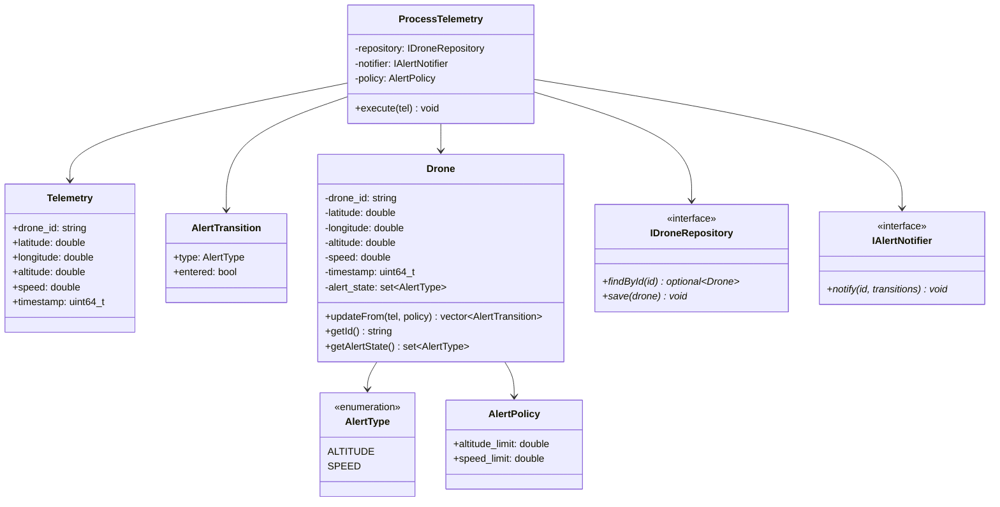
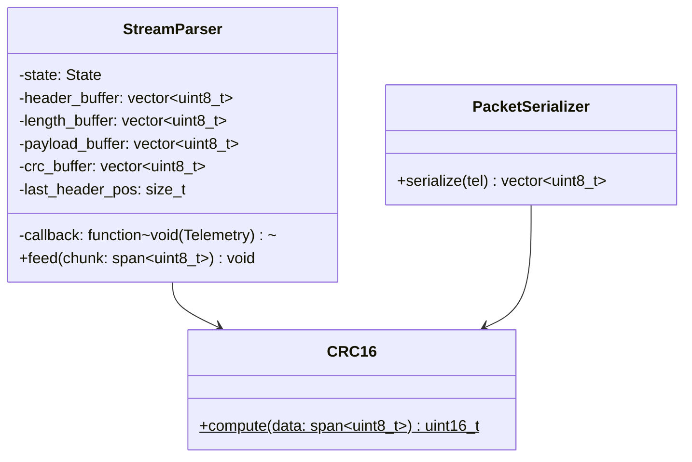
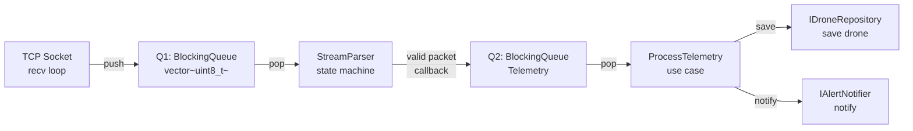
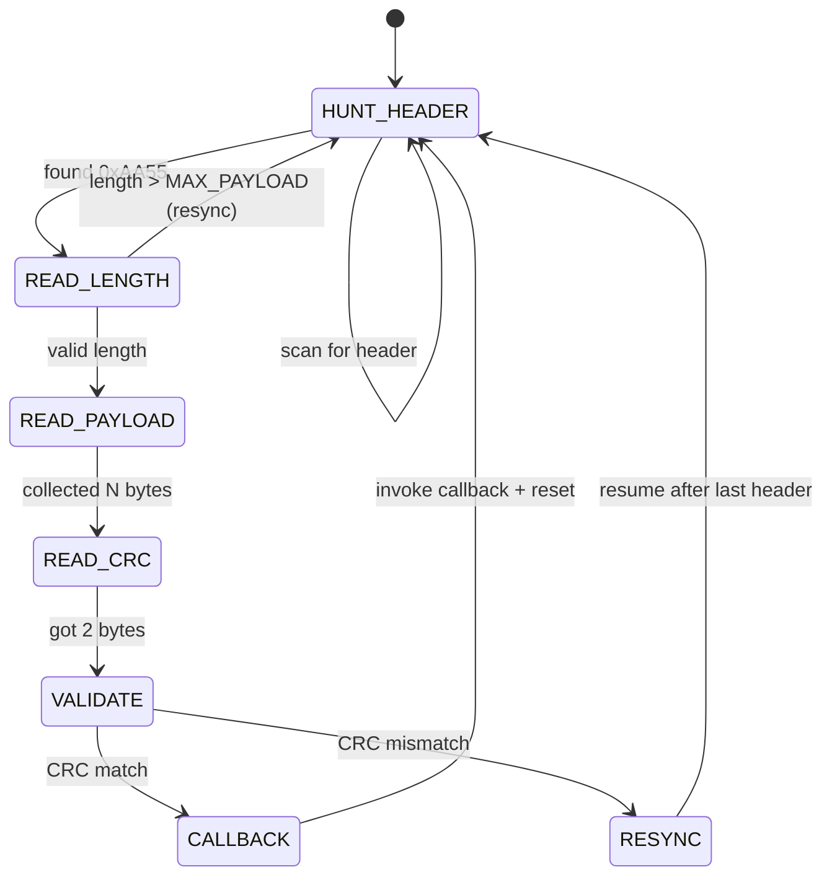

# C4 Code Level: Drone Stream Parser

## Overview

- **Name**: Drone Stream Parser — Multi-threaded C++ Telemetry Processing System
- **Description**: A streaming parser with state machine resynchronization that processes incoming binary telemetry data from drone connections. Validates packets with CRC16, deserializes telemetry, maintains drone state, and triggers alerts on threshold violations. Uses a 3-stage pipeline with bounded queues for backpressure.
- **Location**: `/home/yoseforb/pkg/drone-stream-parser/drone-stream-parser/`
- **Language**: C++20
- **Standard**: Linux (Ubuntu), GCC 15.2.1, CMake 4.2.3
- **Purpose**: Real-time embedded telemetry streaming with robust recovery from packet loss, corruption, and partial arrival

---

## Architectural Boundaries

The system is organized into three isolated boundaries plus a composition root:

```
Composition Root (main.cpp)
        │
        ├─ creates & injects
        │
├───────┼───────────────┬──────────────────────┐
│       │               │                      │
▼       ▼               ▼                      ▼
Domain  Protocol    Infrastructure           Common
```

### 1. Domain Boundary (domain/)

**Purpose**: Pure business logic isolated from I/O and infrastructure concerns.

**DDD Classification**:
- **Entity**: Drone — has identity (`drone_id`), mutable state, and behavior (`updateFrom()`)
- **Value Objects**: Telemetry, AlertType, AlertTransition — immutable, no identity, compared by value
- **Policy Object**: AlertPolicy — external configuration governing evaluation thresholds, not owned by any entity. Injected per-call to keep entity state clean and avoid leaking policy storage into the repository.
- **Use Case**: ProcessTelemetry — orchestrates domain operations, owns no business logic itself
- **Ports**: IDroneRepository, IAlertNotifier — domain-defined interfaces for infrastructure concerns

**Characteristics**:
- Zero external dependencies
- All functions `noexcept` (cannot fail)
- Unit tested in isolation with fakes for ports
- Dependency direction: INBOUND ONLY (Protocol and Infrastructure depend on Domain)

#### Value Objects

**Telemetry**
- **Type**: `struct`
- **Location**: `domain/include/telemetry.hpp`
- **Purpose**: Immutable snapshot of drone state at a point in time
- **Fields**:
  - `drone_id: std::string` — unique identifier for this drone
  - `latitude: double` — decimal degrees
  - `longitude: double` — decimal degrees
  - `altitude: double` — meters above sea level
  - `speed: double` — meters per second
  - `timestamp: uint64_t` — Unix timestamp (milliseconds)
- **Responsibility**: Value container, no behavior
- **Dependencies**: None
- **Immutability**: Immutable by design convention, not language enforcement. Fields are public (making them `const` would break move semantics needed for pipeline efficiency). Each Telemetry is constructed once, moved through queues, and never modified after construction.

**AlertType**
- **Type**: `enum`
- **Location**: `domain/include/alert_type.hpp`
- **Purpose**: Enumeration of possible alert conditions
- **Values**: `ALTITUDE`, `SPEED`
- **Responsibility**: Type-safe alert classification
- **Dependencies**: None

**AlertTransition**
- **Type**: `struct`
- **Location**: `domain/include/alert_transition.hpp`
- **Purpose**: Represents a change in drone alert state
- **Fields**:
  - `type: AlertType` — which alert transitioned
  - `entered: bool` — true if alert began, false if cleared
- **Responsibility**: Signal-value pair for state changes
- **Dependencies**: `AlertType`

**AlertPolicy**
- **Type**: `struct`
- **Location**: `domain/include/alert_policy.hpp`
- **Purpose**: Configuration for alert threshold evaluation
- **Fields**:
  - `altitude_limit: double` — default 120.0 meters
  - `speed_limit: double` — default 50.0 m/s
- **Responsibility**: Immutable threshold container, injected at composition
- **Characteristics**: `constexpr` defaults for zero-cost abstraction
- **Dependencies**: None

#### Entity: Drone

**Type**: `class`
**Location**: `domain/include/drone.hpp`
**Purpose**: Stateful entity representing a single drone with identity and alert history

**Identity**: `drone_id: std::string` (uniquely identifies across system lifetime)

**State Fields**:
- `latitude: double`, `longitude: double`, `altitude: double`, `speed: double`, `timestamp: uint64_t`
- `alert_state: std::set<AlertType>` — currently active alerts (extensible)

**Key Method**:
```cpp
std::vector<AlertTransition> updateFrom(
    const Telemetry& tel,
    const AlertPolicy& policy
) noexcept
```

- **Behavior**: Updates all state fields from telemetry, evaluates alert thresholds, returns vector of entered/cleared alerts
- **Responsibility**: Pure domain logic, cannot fail
- **Design**: `noexcept` because it's pure arithmetic

**Other Methods**:
- `Drone(const std::string& id)` — constructor, zero-initializes state
- `getId() const → const std::string&` — returns drone ID
- `getAlertState() const → const std::set<AlertType>&` — returns current alerts

**Design Rationale**:
- Rich entity pattern (DDD): behavior lives with data — Drone owns its update and alert evaluation logic
- AlertPolicy is NOT a Drone field — it is a policy object, external to the entity. The Drone knows *how* to evaluate (behavior), but thresholds come from outside (system configuration). This avoids leaking policy storage into IDroneRepository.
- `std::set<AlertType>` allows future alert types without code changes
- No separate Position value object (YAGNI)

#### Use Case: ProcessTelemetry

**Type**: `class`
**Location**: `domain/include/process_telemetry.hpp`
**Purpose**: Application logic orchestrating drone state updates and alert notifications

**Constructor**:
```cpp
ProcessTelemetry(
    IDroneRepository& repository,
    IAlertNotifier& notifier,
    const AlertPolicy& policy
)
```

**Method**:
```cpp
void execute(const Telemetry& telemetry)
// Throws: std::exception if repository or notifier operations fail
```

**Execution Flow**:
1. Call `repository.findById(telemetry.drone_id)` → `std::optional<Drone>`
2. If absent, construct new `Drone(telemetry.drone_id)`
3. Call `drone.updateFrom(telemetry, policy)` → `vector<AlertTransition>`
4. Call `repository.save(drone)` → persist state
5. If transitions non-empty, call `notifier.notify(drone_id, transitions)`

**Responsibility**:
- Coordinates between domain entity, repository port, and notifier port
- Decides when to notify (only on state transitions)
- Propagates infrastructure exceptions upward

**Dependencies**: `Drone`, `Telemetry`, `AlertPolicy`, `IDroneRepository`, `IAlertNotifier`

#### Port Interface: IDroneRepository

**Type**: `interface (pure abstract class)`
**Location**: `domain/include/i_drone_repository.hpp`
**Purpose**: Abstraction for drone persistence (read/write)

**Methods**:

| Method | Signature | Semantics |
|--------|-----------|-----------|
| `findById()` | `findById(const std::string& drone_id) → std::optional<Drone>` | Returns drone copy or `std::nullopt` if new (not an error). |
| `save()` | `save(const Drone& drone) → void` | Persists drone state. Throws on I/O failure. |

**Design Rationale**:
- `findById()` returns `std::optional` because new drones are normal (not exceptional)
- `save()` throws because storage failure is exceptional and unrecoverable at domain level

#### Port Interface: IAlertNotifier

**Type**: `interface (pure abstract class)`
**Location**: `domain/include/i_alert_notifier.hpp`
**Purpose**: Abstraction for alert notification channel

**Methods**:

| Method | Signature | Semantics |
|--------|-----------|-----------|
| `notify()` | `notify(const std::string& drone_id, const std::vector<AlertTransition>& transitions) → void` | Sends alert notification to observer. Throws on transmission failure. |

**Design Rationale**:
- Called only when transitions non-empty (use case responsibility)
- Single method because domain doesn't care how alerts are delivered

---

### 2. Protocol Boundary (protocol/)

**Purpose**: Packet parsing, serialization, and CRC validation. Stateful state machine for handling fragmented/corrupted streams.

**Characteristics**:
- Depends only on Domain types (`Telemetry`, value objects)
- All functions `noexcept` (pure computation)
- Heavily unit tested with raw byte feeds
- No I/O, no concurrency — pure state machine

#### Wire Format Specification

**Packet Structure** (sent over TCP):
```
[HEADER][LENGTH][PAYLOAD][CRC]
```

| Field | Size | Endianness | Purpose |
|-------|------|-----------|---------|
| `HEADER` | 2 bytes | fixed pattern | Fixed byte sequence `0xAA 0x55` for packet boundary |
| `LENGTH` | 2 bytes (uint16_t) | little-endian | Size of PAYLOAD in bytes |
| `PAYLOAD` | LENGTH bytes | variable | Serialized Telemetry struct |
| `CRC` | 2 bytes (uint16_t) | little-endian | CRC16 checksum over HEADER + LENGTH + PAYLOAD |

**Total Packet Size**: 6 + LENGTH bytes (minimum 6 bytes for zero-length payload)

**Serialization Encoding** (within PAYLOAD):
- All numbers: little-endian
- `drone_id`: length-prefixed string (2-byte uint16_t count, then UTF-8 bytes)
- `latitude`, `longitude`, `altitude`, `speed`: IEEE 754 double (8 bytes each)
- `timestamp`: uint64_t (8 bytes)

#### crc16() Function

**Type**: `function`
**Location**: `protocol/include/crc16.hpp`
**Signature**:
```cpp
uint16_t crc16(std::span<const uint8_t> data) noexcept
```

**Purpose**: Compute CRC16-CCITT (0x1021 polynomial) checksum

**Parameters**:
- `data`: input byte buffer (immutable view via `std::span<const uint8_t>`)

**Returns**: 16-bit CRC value (0x0000–0xFFFF)

**Responsibility**: Pure computation, exact polynomial match for interoperability

**Dependencies**: None (C++20 standard library only)

#### PacketSerializer

**Type**: `class`
**Location**: `protocol/include/packet_serializer.hpp`
**Purpose**: Serialize Telemetry struct into wire-format bytes for transmission

**Method**:
```cpp
std::vector<uint8_t> serialize(const Telemetry& tel)
```

**Execution**:
1. Serialize `drone_id` as length-prefixed string
2. Append doubles: latitude, longitude, altitude, speed (little-endian IEEE 754)
3. Append `timestamp` as uint64_t (little-endian)
4. Construct packet: `HEADER (0xAA 0x55) | LENGTH | PAYLOAD | CRC16(all)`
5. Return complete packet bytes

**Responsibility**: Encode domain types to bytes

**Dependencies**: `Telemetry`, `crc16()` function

**Design Notes**: Serialization is deterministic but allocates (`std::vector`). May throw `std::bad_alloc` on allocation failure, so not marked `noexcept`.

#### StreamParser (State Machine)

**Type**: `class`
**Location**: `protocol/include/stream_parser.hpp`
**Purpose**: Parse incoming byte stream into complete packets. Handle fragmentation, corruption, and automatic resynchronization.

**State Enumeration**:
```
HUNT_HEADER       → scan byte-by-byte for 0xAA then 0x55
READ_LENGTH       → collect 2-byte length field
READ_PAYLOAD      → collect N bytes of payload data
READ_CRC          → collect 2-byte CRC field
```

**Constants**:
- `MAX_PAYLOAD = 4096` — maximum allowed payload size in bytes. If the parsed length field exceeds this value, the packet is rejected and the parser resyncs from the byte after the last header position.

**Constructor**:
```cpp
StreamParser(std::function<void(Telemetry)> on_packet_callback)
```

**Method**:
```cpp
void feed(std::span<const uint8_t> chunk) noexcept
```

**State Execution Logic**:

1. **HUNT_HEADER**:
   - Scan chunk for sequence `0xAA 0x55`
   - On match: advance to `READ_LENGTH`, record header position
   - On non-match: discard chunk

2. **READ_LENGTH**:
   - Accumulate bytes until 2 bytes collected
   - Interpret as `uint16_t` length value
   - If length > `MAX_PAYLOAD` (4096): reject, resync from byte after last header position, return to `HUNT_HEADER`
   - Advance to `READ_PAYLOAD`

3. **READ_PAYLOAD**:
   - Accumulate payload bytes until `length` bytes collected
   - Advance to `READ_CRC`

4. **READ_CRC**:
   - Accumulate 2 bytes
   - Compute CRC16 over HEADER + LENGTH + PAYLOAD
   - Compare to received CRC
   - **If match** (valid packet):
     - Deserialize PAYLOAD → Telemetry
     - Invoke callback with Telemetry
     - Reset to `HUNT_HEADER`
   - **If mismatch** (corrupted packet):
     - Rewind: resume scanning from byte after last header position (resync)
     - Return to `HUNT_HEADER`

**Responsibility**:
- Implement resilient parsing with automatic recovery
- Handle fragmentation transparently
- Detect corruption and resynchronize
- Invoke callback for each valid packet

**Callback Semantics**:
- Called exactly once per valid packet
- Invoked with fully deserialized Telemetry
- Callback executes synchronously within `feed()` and must not throw (`noexcept` context). A throwing callback triggers `std::terminate()`.
- If the callback blocks (e.g., bounded queue back-pressure), `feed()` blocks — this is intentional back-pressure propagation through the pipeline (see ADR-006).

**Design Notes**:
- `noexcept` because state machine can always progress (never fails). The callback is part of this contract — it must also be noexcept.
- Callback-based (not returning packets) fits streaming nature
- Resync strategy: rewind to byte after last `0xAA55`, search again. Prevents infinite loop on persistent corruption.
- Maintains internal buffer for partial state across `feed()` calls

**Internal Accumulation Buffer:**
- StreamParser maintains an internal `std::vector<uint8_t>` accumulation buffer.
- When `feed()` is called, incoming bytes are appended to this buffer.
- The state machine operates on the buffer contents via a read cursor position.
- On successful packet parse: consumed bytes are erased from the front of the buffer.
- On resync (CRC mismatch or invalid length): the read cursor rewinds within this buffer to one byte after the `0xAA` that started the failed attempt. Parsing resumes from there.
- This buffer is essential for the rewind-based resync strategy — without it, bytes from previous `feed()` calls would be gone and resync would be impossible.

---

### 3. Infrastructure Boundary (server/)

**Purpose**: OS-level integration, I/O, concurrency, and port implementations.

**Characteristics**:
- May throw exceptions on I/O failure
- Integration tested via client binary
- Depends on Protocol and Domain
- Thread-safe (proper synchronization)

#### TcpServer

**Type**: `class`
**Location**: `server/include/tcp_server.hpp`
**Purpose**: TCP listener that accepts connections sequentially (one at a time) and pushes raw received bytes to Q1. After a client disconnects, returns to accept() to await the next connection. Only exits when stop_flag is set. Does NOT parse — parsing is a separate stage (Thread 2).

**Constructor**:
```cpp
TcpServer(
    uint16_t port,
    BlockingQueue<std::vector<uint8_t>>& output_queue,
    const std::atomic<bool>& stop_flag
)
```

**Parameters**:
- `port`: TCP port to listen on (e.g., 5000)
- `output_queue`: destination queue for raw byte chunks (Q1)
- `stop_flag`: atomic reference to graceful shutdown signal

**Methods**:

| Method | Signature | Behavior |
|--------|-----------|----------|
| `run()` | `void run()` | Two-loop event loop: outer loop accepts connections sequentially, inner loop receives bytes and pushes to Q1. Client disconnect returns to accept(). Exits only when `stop_flag` is set. Uses `poll()` with timeout for responsive shutdown. |

**Execution Flow**:
1. Create, bind, and listen on configured address and port
2. **Outer loop** (exits only when `stop_flag` is set):
   a. `poll()` on listening socket with timeout (e.g., 200ms) — enables responsive stop_flag checking
   b. On `POLLIN`: `accept()` incoming connection
   c. **Inner loop** (exits on client disconnect or `stop_flag`):
      - `poll()` on client socket with timeout (e.g., 200ms)
      - On `POLLIN`: `recv()` bytes in chunks (e.g., 4KB)
      - On data: call `output_queue.push(std::move(chunk))`
      - On `recv()` returning 0 (EOF): client disconnected — break inner loop
      - On `recv()` error: log, break inner loop
   d. Close client socket
   e. Continue outer loop (return to accept)
3. After outer loop exits: close listening socket, call `output_queue.close()`

**Responsibility**:
- POSIX TCP socket setup and sequential connection acceptance
- `poll()`-based event loop for both accept and recv (responsive to stop_flag)
- Backpressure handling (queue bounded; server blocks on full queue)
- Client disconnect recovery (return to accept, no pipeline shutdown)

**Dependencies**: `BlockingQueue<std::vector<uint8_t>>`, POSIX socket APIs

#### SignalHandler

**Type**: `class`
**Location**: `server/include/signal_handler.hpp`
**Purpose**: Install POSIX signal handler for graceful shutdown on SIGINT, SIGTERM

**Constructor**:
```cpp
SignalHandler(std::atomic<bool>& stop_flag)
```

**Method**:
```cpp
void install() noexcept
```

**Execution**:
1. Register POSIX signal handler for SIGINT (Ctrl+C) and SIGTERM
2. On receipt: set `stop_flag = true`
3. Return to normal program execution (signal handler sets flag, doesn't exit)

**Responsibility**:
- Atomic flag management for inter-thread shutdown signaling
- POSIX signal safety (only use async-signal-safe functions inside handler)

**Dependencies**: `<signal.h>`, `std::atomic<bool>`

#### InMemoryDroneRepository

**Type**: `class`
**Location**: `server/include/in_memory_drone_repository.hpp`
**Purpose**: Implements IDroneRepository with in-memory `std::unordered_map<string, Drone>`

**Constructor**:
```cpp
InMemoryDroneRepository()
```

**Methods**:

| Method | Signature | Behavior |
|--------|-----------|----------|
| `findById()` | `std::optional<Drone> findById(const std::string& drone_id) override` | If key exists in map, return copy. Otherwise return `std::nullopt`. |
| `save()` | `void save(const Drone& drone) override` | Insert or update map entry. |

**Internal State**:
- `std::unordered_map<std::string, Drone> drones`

**Thread Safety**: No mutex needed -- accessed only from Stage 3 thread (single-consumer pipeline guarantee).

**Responsibility**:
- Implements domain port interface
- No persistence (data lost on shutdown)

**Dependencies**: `IDroneRepository`, `Drone`, `<unordered_map>`

#### ConsoleAlertNotifier

**Type**: `class`
**Location**: `server/include/console_alert_notifier.hpp`
**Purpose**: Implements IAlertNotifier by printing alerts to stdout

**Constructor**:
```cpp
ConsoleAlertNotifier()
```

**Method**:

| Method | Signature | Behavior |
|--------|-----------|----------|
| `notify()` | `void notify(const std::string& drone_id, const std::vector<AlertTransition>& transitions) override` | Format transitions as human-readable text and print to stdout. Flush for immediate visibility. |

**Output Format Example**:
```
[ALERT] Drone D001: ALTITUDE alert ENTERED (threshold 120.0m exceeded)
[ALERT] Drone D001: SPEED alert ENTERED (threshold 50.0m/s exceeded)
[CLEAR] Drone D001: ALTITUDE alert CLEARED
```

**Responsibility**: Format and print alert events

**Dependencies**: `IAlertNotifier`, `<iostream>`

---

### 4. Common Boundary (common/)

**Purpose**: Concurrency primitives and utilities shared across all boundaries.

**Characteristics**:
- Header-only (no compilation unit)
- No business logic (pure concurrency)
- Available to all boundaries without creating dependency

#### BlockingQueue<T> (Template Class)

**Type**: `template <typename T>`
**Location**: `common/include/blocking_queue.hpp`
**Purpose**: Thread-safe, bounded queue for passing data between pipeline stages

**Constructor**:
```cpp
BlockingQueue(size_t max_capacity)
```

**Parameters**:
- `max_capacity`: maximum number of elements before push blocks (back-pressure)

**Methods**:

| Method | Signature | Behavior |
|--------|-----------|----------|
| `push()` | `void push(T&& value)` | Enqueue element via move. Block if full. No-op if closed. |
| `pop()` | `std::optional<T> pop()` | Dequeue element. Block if empty. Return `std::nullopt` if queue closed and empty. |
| `close()` | `void close()` | Mark queue as closed. Existing elements remain available. New push fails. |

**Internal State**:
- `std::deque<T> buffer` — FIFO queue
- `std::mutex lock` — protects buffer
- `std::condition_variable not_empty` — signals waiting pops
- `std::condition_variable not_full` — signals waiting pushes
- `bool closed` — marks queue as closed

**Responsibility**:
- Decouple producer (recv) from consumer (parse/process)
- Implement bounded capacity for backpressure
- Graceful shutdown signal via `close()` → `pop()` returns nullopt

**Type Requirements**:
- `T` must be move-constructible

**Dependencies**: `<deque>`, `<mutex>`, `<condition_variable>`, `<optional>`

---

## Composition Root (server/src/main.cpp)

**Type**: Application entry point
**Location**: `server/src/main.cpp`
**Purpose**: Create all objects, inject dependencies, instantiate pipeline, and manage graceful shutdown

**Execution Flow**:

1. **Configuration**:
   - Parse CLI arguments (port number)
   - Create AlertPolicy with defaults (or from config file in future)

2. **Instantiation**:
   - Create port implementations: `InMemoryDroneRepository`, `ConsoleAlertNotifier`
   - Create domain use case: `ProcessTelemetry(repo, notifier, policy)`
   - Create protocol: `StreamParser(callback that calls use case)`
   - Create infrastructure: `TcpServer`, `SignalHandler`
   - Create queues: `BlockingQueue<vector<uint8_t>>`, `BlockingQueue<Telemetry>`

3. **Thread Spawning**:
   - **Thread 1 (Recv)**: `tcp_server.run()` — blocks on socket accept/recv
   - **Thread 2 (Parse)**: Pops from Q1, feeds to parser, pushes parsed Telemetry to Q2
   - **Thread 3 (Process)**: Pops from Q2, calls `ProcessTelemetry::execute()`

4. **Signal Handling**:
   - `signal_handler.install()` — registers SIGINT/SIGTERM
   - Blocks main thread until signal received

5. **Graceful Shutdown**:
   ```
   SIGINT/SIGTERM
       ↓ signal_handler sets stop_flag
       ↓ TcpServer sees flag, closes socket, calls Q1.close()
       ↓ Parser stage pops nullopt from Q1, calls Q2.close()
       ↓ Process stage pops nullopt from Q2, exits
       ↓ main() joins all threads, exits
   ```

**Responsibilities**:
- Dependency injection
- Object lifetime management (RAII)
- Thread coordination and cleanup

**Key Design Decisions**:
- Queues created on stack in main (automatic cleanup)
- Threads receive queue references (borrowed, not owned)
- Shutdown cascade prevents data loss

---

## Client Binary (client/src/main.cpp)

**Type**: Separate test utility
**Location**: `client/src/main.cpp`
**Purpose**: Connect to server and send test telemetry packets for integration testing

**Execution Flow**:

1. **Parse Arguments**: host, port, drone count, packet count
2. **Connect**: TCP client socket to `host:port`
3. **Generate Test Data**:
   - Create Telemetry for each drone with varying altitude/speed
   - Simulate alerts by varying parameters
   - Serialize each Telemetry via `PacketSerializer`
4. **Send Packets**: Write serialized bytes to socket
5. **Cleanup**: Close socket on exit

**Responsibilities**:
- Provide reproducible test scenarios
- Validate server packet reception and parsing
- Exercise server under load (1000+ pps if multi-threaded client)

**Dependencies**: `PacketSerializer`, POSIX socket APIs

---

## Dependencies Summary

### Internal Dependencies

```
Infrastructure
  └── depends on: Protocol, Domain
      └── TcpServer, SignalHandler, InMemoryDroneRepository, ConsoleAlertNotifier

Protocol
  └── depends on: Domain
      └── StreamParser, PacketSerializer, crc16()

Domain
  └── depends on: nothing (pure logic)
      └── Drone, Telemetry, AlertType, AlertPolicy, AlertTransition
      └── ProcessTelemetry, IDroneRepository, IAlertNotifier

Common
  └── depends on: nothing (concurrency utilities)
      └── BlockingQueue<T>
```

### External Dependencies

| Dependency | Scope | Purpose |
|------------|-------|---------|
| `C++20 Standard Library` | All | `<string>`, `<vector>`, `<unordered_map>`, `<mutex>`, `<condition_variable>`, `<optional>`, `<span>`, `<functional>` |
| `POSIX APIs` | Infrastructure | `<unistd.h>`, `<sys/socket.h>`, `<netinet/in.h>`, `<signal.h>` |
| `spdlog` | All (via CMake FetchContent, compiled mode) | Structured logging (packet counts, CRC failures, connection events, shutdown) |
| `GTest + GMock` | Unit tests (via FetchContent) | Mock repository, notifier; fake callbacks |
| `CMake` | Build | Project configuration, target definitions |
| `GCC 15.2.1` | Compilation | C++20 support, optimization |

---

## Code Architecture Diagrams

### Domain Boundary Class Diagram



### Protocol Boundary Class Diagram



### Data Pipeline



### StreamParser State Machine



---

## Concurrency Model

### Thread Responsibilities

| Thread | Function | Blocking Point | Shutdown Signal |
|--------|----------|-----------------|-----------------|
| **Recv** | Accept TCP, recv bytes → Q1 | `recv()` system call or Q1 full | Closes socket, calls Q1.close() |
| **Parse** | Pop Q1 → feed parser → push Q2 | Q1 empty or Q2 full | Q1.pop() returns nullopt → calls Q2.close() |
| **Process** | Pop Q2 → execute use case | Q2 empty | Q2.pop() returns nullopt → exits loop |

### Graceful Shutdown Cascade

```
Event: SIGINT/SIGTERM delivered
  ↓
SignalHandler::install() callback executes
  ↓ sets stop_flag = true
  ↓
TcpServer::run() checks stop_flag
  ↓ closes listening socket
  ↓ closes active connection
  ↓ calls output_queue.close()
  ↓
Parse thread: Q1.pop() returns nullopt
  ↓ recognizes queue closed
  ↓ calls output_queue.close()
  ↓
Process thread: Q2.pop() returns nullopt
  ↓ recognizes queue closed
  ↓ exits loop naturally
  ↓
main(): calls thread.join() on all three threads
  ↓ all join successfully (no deadlock)
  ↓ main() exits normally
```

**Key Property**: No data silently dropped. Each stage drains its input before closing its output.

---

## Error Handling Strategy

### Three Complementary Tools

| Tool | Used For | Example |
|------|----------|---------|
| `std::optional<T>` | Expected absence (not an error) | `findById()` returns nullopt for new drones |
| Exceptions | Exceptional failures (I/O, storage) | `save()` throws on storage failure; `notify()` throws on transmission error |
| `noexcept` | Pure logic that cannot fail | `Drone::updateFrom()`, `crc16()`, `StreamParser::feed()` |

### Function Error Contracts

| Function | Can Fail? | Handling |
|----------|-----------|---------|
| `Drone::updateFrom()` | No | `noexcept` (pure arithmetic) |
| `StreamParser::feed()` | No | `noexcept` (state machine always progresses; resync on corruption) |
| `crc16()` | No | `noexcept` (pure computation) |
| `PacketSerializer::serialize()` | No | Deterministic but allocates; not marked `noexcept` |
| `IDroneRepository::findById()` | No | Returns `std::optional<Drone>` (absence is normal, not error) |
| `IDroneRepository::save()` | Yes | `throws` (storage failure is exceptional) |
| `IAlertNotifier::notify()` | Yes | `throws` (transmission failure is exceptional) |
| `ProcessTelemetry::execute()` | Yes | `throws` (propagates port exceptions) |
| `TcpServer::run()` | Yes | `throws` (socket errors exceptional) |

### Caller Responsibilities

- **Domain code**: All `noexcept` (no error handling needed)
- **Protocol code**: All `noexcept` (no error handling needed)
- **Infrastructure code**: Catch exceptions, log, decide on retry
- **main.cpp**: Catch top-level exceptions, print to stderr, exit with code

---

## Testing Strategy by Boundary

### Domain (Unit Tests with Fakes)

```cpp
class FakeDroneRepository : public IDroneRepository { /* ... */ };
class FakeAlertNotifier : public IAlertNotifier { /* ... */ };

TEST(DroneTest, UpdateExceedsAltitudeThreshold) {
    Drone drone("D001");
    Telemetry tel{...altitude: 125.0...};
    AlertPolicy policy{...altitude_limit: 120.0...};

    auto transitions = drone.updateFrom(tel, policy);

    EXPECT_EQ(transitions.size(), 1);
    EXPECT_EQ(transitions[0].type, AlertType::ALTITUDE);
    EXPECT_TRUE(transitions[0].entered);
}

TEST(ProcessTelemetryTest, CreatesNewDroneOnFirstTelemetry) {
    FakeDroneRepository repo;
    FakeAlertNotifier notifier;
    AlertPolicy policy{...};
    ProcessTelemetry usecase(repo, notifier, policy);

    Telemetry tel{...drone_id: "D001"...};
    usecase.execute(tel);

    EXPECT_TRUE(repo.contains("D001"));
}
```

### Protocol (Unit Tests with Raw Bytes)

```cpp
TEST(StreamParserTest, HandleFragmentedPacket) {
    std::vector<Telemetry> results;
    StreamParser parser([&](Telemetry tel) { results.push_back(tel); });

    std::vector<uint8_t> packet = /* serialize valid packet */;

    // Feed first half
    parser.feed(std::span(packet.data(), packet.size() / 2));
    EXPECT_EQ(results.size(), 0); // not complete yet

    // Feed second half
    parser.feed(std::span(packet.data() + packet.size() / 2, packet.size() / 2));
    EXPECT_EQ(results.size(), 1); // complete packet parsed
}

TEST(StreamParserTest, ResyncOnCrcFailure) {
    std::vector<Telemetry> results;
    StreamParser parser([&](Telemetry tel) { results.push_back(tel); });

    std::vector<uint8_t> packet1 = /* serialize valid packet */;
    std::vector<uint8_t> corrupt = /* packet with wrong CRC */;
    std::vector<uint8_t> packet2 = /* another valid packet */;

    std::vector<uint8_t> stream;
    stream.insert(stream.end(), packet1.begin(), packet1.end());
    stream.insert(stream.end(), corrupt.begin(), corrupt.end());
    stream.insert(stream.end(), packet2.begin(), packet2.end());

    parser.feed(stream);
    EXPECT_EQ(results.size(), 2); // two valid packets, corrupt skipped
}

TEST(StreamParserTest, RejectsOversizedPayloadLength) {
    std::vector<Telemetry> results;
    StreamParser parser([&](Telemetry tel) { results.push_back(tel); });

    // Packet with LENGTH = 5000 (exceeds MAX_PAYLOAD = 4096)
    std::vector<uint8_t> oversized = {0xAA, 0x55, 0x88, 0x13}; // 0x1388 = 5000 LE
    // ... followed by a valid packet
    std::vector<uint8_t> valid_packet = /* serialize valid packet */;

    std::vector<uint8_t> stream;
    stream.insert(stream.end(), oversized.begin(), oversized.end());
    stream.insert(stream.end(), valid_packet.begin(), valid_packet.end());

    parser.feed(stream);
    EXPECT_EQ(results.size(), 1); // only the valid packet parsed
    EXPECT_GE(parser.malformed_count(), 1); // oversized rejected
}
```

### Infrastructure (Integration Tests via Client)

Client binary sends known test packets; server outputs to console; test harness validates output.

---

## File Structure (Planned Directory Layout)

```
domain/
├── include/
│   ├── telemetry.hpp
│   ├── alert_type.hpp
│   ├── alert_transition.hpp
│   ├── alert_policy.hpp
│   ├── drone.hpp
│   ├── i_drone_repository.hpp
│   ├── i_alert_notifier.hpp
│   └── process_telemetry.hpp
└── src/
    ├── drone.cpp
    └── process_telemetry.cpp

protocol/
├── include/
│   ├── crc16.hpp
│   ├── packet_serializer.hpp
│   └── stream_parser.hpp
└── src/
    ├── crc16.cpp
    ├── packet_serializer.cpp
    └── stream_parser.cpp

server/
├── include/
│   ├── tcp_server.hpp
│   ├── signal_handler.hpp
│   ├── in_memory_drone_repository.hpp
│   └── console_alert_notifier.hpp
└── src/
    ├── tcp_server.cpp
    ├── signal_handler.cpp
    ├── in_memory_drone_repository.cpp
    ├── console_alert_notifier.cpp
    └── main.cpp (server entry point)

client/
├── include/
└── src/
    └── main.cpp (client entry point)

common/
└── include/
    └── blocking_queue.hpp

tests/
├── domain/
│   ├── drone_test.cpp
│   ├── process_telemetry_test.cpp
│   └── fakes/
│       ├── fake_drone_repository.hpp
│       └── fake_alert_notifier.hpp
└── protocol/
    ├── crc16_test.cpp
    ├── packet_serializer_test.cpp
    └── stream_parser_test.cpp

CMakeLists.txt
```

---

## Design Rationale Summary

| Decision | Rationale | Trade-offs |
|----------|-----------|-----------|
| 3 boundaries not 4 | Clean architecture where it earns its keep (domain isolation, protocol unit tests). No ceremony for infrastructure (integration tested via client). | Requires integration tests; pure unit tests wouldn't catch socket bugs. Justified by domain size. |
| Dependency direction (inward) | Protocol depends on Domain. Infrastructure depends on Protocol + Domain. Protects domain from I/O changes. | Requires port interfaces (IDroneRepository, IAlertNotifier) defined in Domain. |
| `noexcept` on domain/protocol | Pure logic never fails; signals purity and lack of I/O. | Caller cannot distinguish success from "logic state unchanged" (must read contracts). |
| Optional for findById, throws for save | New drones are normal (not exceptional); storage errors are exceptional. | Asymmetric error contracts require caller attention. |
| 3-stage pipeline | Spec requires 3+ threads. Stages have different blocking points (I/O vs processing). Extensible for future improvements. | More complexity than 2 threads. Justified by spec + extensibility. |
| Bounded BlockingQueue | Back-pressure prevents unbounded memory growth (critical for embedded). | Recv thread blocks when queue full. Acceptable for TCP (OS buffer handles re-send). |
| In-memory repository | Simple for development; integration testable; no external dependencies. | Production requires persistent store. Design allows swap at composition root. |
| `std::set<AlertType>` | Extensible to future alert types without code changes. No combinatorial explosion. | Slightly slower lookup than bitfield; negligible for small alert count. |
| Resync on CRC failure | Automatic recovery from bit flips; no manual intervention needed. | Doesn't distinguish bit flip from packet loss (both trigger resync). Acceptable. |
| Callback-based parser | Fits streaming nature; parser doesn't buffer complete packets (memory efficient). | Caller must handle callback exceptions; complicates error propagation. |

---

## Summary Table: All Code Elements

| Element | Type | Location | Purpose | Dependencies |
|---------|------|----------|---------|--------------|
| **Telemetry** | struct | domain/include/telemetry.hpp | Immutable data snapshot | none |
| **AlertType** | enum | domain/include/alert_type.hpp | Alert classification | none |
| **AlertTransition** | struct | domain/include/alert_transition.hpp | State change signal | AlertType |
| **AlertPolicy** | struct | domain/include/alert_policy.hpp | Threshold configuration | none |
| **Drone** | class | domain/include/drone.hpp | Entity with state + behavior | Telemetry, AlertType, AlertPolicy |
| **ProcessTelemetry** | class | domain/include/process_telemetry.hpp | Use case orchestrator | IDroneRepository, IAlertNotifier, Drone |
| **IDroneRepository** | interface | domain/include/i_drone_repository.hpp | Persistence port | Drone |
| **IAlertNotifier** | interface | domain/include/i_alert_notifier.hpp | Notification port | AlertTransition |
| **crc16()** | function | protocol/include/crc16.hpp | Checksum computation | none |
| **PacketSerializer** | class | protocol/include/packet_serializer.hpp | Telemetry -> bytes | Telemetry, crc16() |
| **StreamParser** | class | protocol/include/stream_parser.hpp | State machine parser | Telemetry, crc16() |
| **TcpServer** | class | server/include/tcp_server.hpp | TCP socket listener | BlockingQueue |
| **SignalHandler** | class | server/include/signal_handler.hpp | Graceful shutdown | std::atomic |
| **InMemoryDroneRepository** | class | server/include/in_memory_drone_repository.hpp | Memory-based persistence | IDroneRepository |
| **ConsoleAlertNotifier** | class | server/include/console_alert_notifier.hpp | Stdout alerting | IAlertNotifier |
| **BlockingQueue<T>** | template | common/include/blocking_queue.hpp | Thread-safe queue | std::mutex, std::condition_variable |

---

## Notes and Future Considerations

1. **Production Improvements**:
   - Replace `InMemoryDroneRepository` with persistent store (SQLite, Redis, etc.)
   - Add metrics/stats collection (CRC failures, packets/sec, latency percentiles)
   - Implement multiple client support (thread per connection or epoll-based)
   - Add configuration file for AlertPolicy and port number
   - Structured logging (JSON format for parsing)

2. **Performance Optimizations**:
   - Profile parser's state machine (likely bottleneck)
   - Lock-free queue if contention measured
   - Batch writes to repository
   - Connection pooling if using external database

3. **Robustness**:
   - Timeout on incomplete packets (optional; current design resumes on next header)
   - Maximum payload size validation in parser
   - Connection limit in TcpServer
   - Graceful degradation if repository/notifier fail

4. **Testing**:
   - Fuzz testing for parser (AFL with packet generator)
   - Load testing with concurrent clients
   - Network fault injection (packet loss, reordering, corruption)
   - Memory leak detection (Valgrind, AddressSanitizer)

5. **Documentation**:
   - API documentation (Doxygen)
   - Wire format specification (binary protocol guide)
   - Deployment guide (systemd unit, socket activation)
   - Troubleshooting guide (common errors, debug logs)

---

Generated: 2026-03-05
Status: DRAFT — Ready for code implementation
Architecture Standard: Clean Architecture with Pragmatic Boundaries
