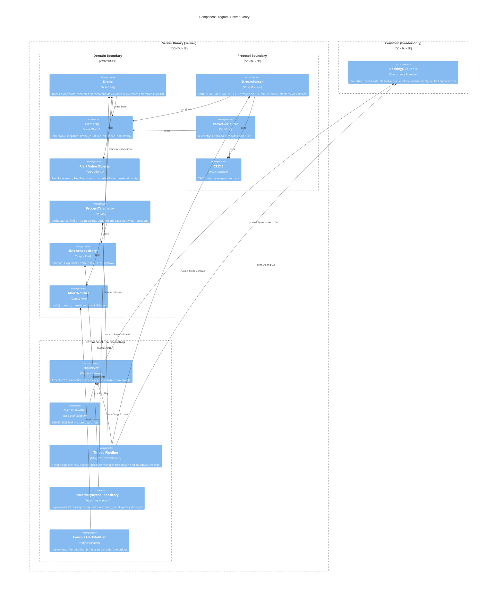
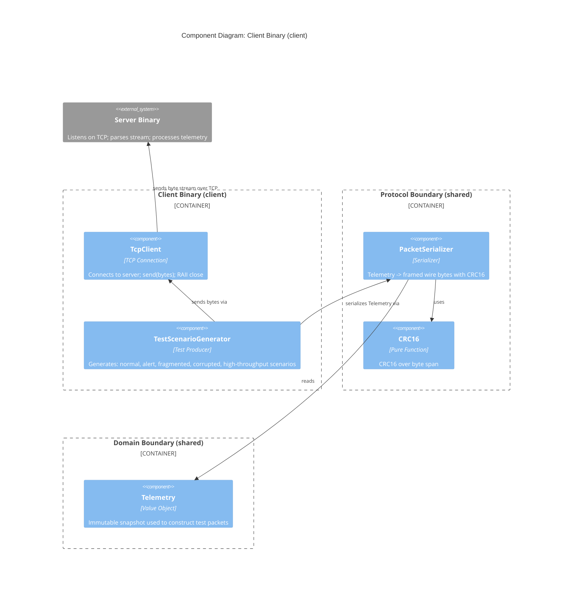
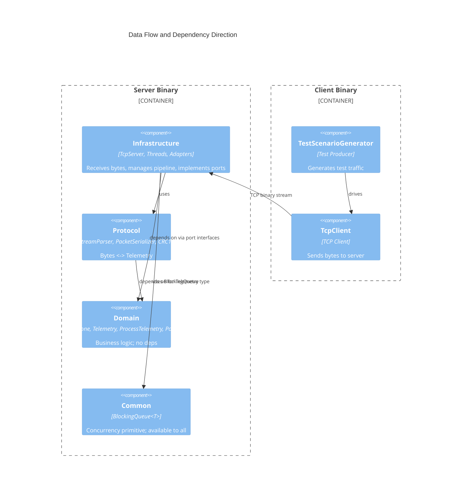

# C4 Component Level: Drone Stream Parser

**Date:** 2026-03-05
**Status:** DRAFT
**Standard:** C4 Model — Component Level

---

## Overview

The Drone Stream Parser system consists of two binaries:

- **Server binary** — receives a continuous binary stream from drone clients over TCP,
  parses telemetry packets, evaluates alert thresholds, and maintains an in-memory
  drone registry.
- **Client binary** — an independent test tool that generates synthetic telemetry,
  serializes it to wire format, and sends it to the server over TCP.

The server is organized into three architectural boundaries plus a cross-cutting
common utility. Components are listed by boundary below.

---

## 1. Server Binary — Component Map

### 1.1 Domain Boundary

The innermost boundary. Zero external dependencies. Pure C++20. Fully unit-tested
with fakes for ports.

---

#### Component: Drone Entity

- **Name:** Drone
- **Type:** Rich Domain Entity
- **Identity:** `drone_id` (string)
- **Owns:** latest telemetry fields (lat, lon, alt, speed, timestamp) + alert state

**Purpose**

Represents a single tracked drone. Encapsulates the update and alert-state transition
logic so that no other component needs to reason about alert thresholds or state
transitions. The entity is the single authority over what alerts are currently active
for a drone.

**Software Features**

- Holds the current state of one drone: latitude, longitude, altitude, speed, timestamp.
- Maintains an active alert set (`std::set<AlertType>`) — extensible without
  combinatorial explosion.
- Applies `AlertPolicy` thresholds to incoming telemetry and computes state transitions.
- Returns a `vector<AlertTransition>` describing which alerts were entered or cleared
  (the use case decides what to do with them).
- Marked `noexcept` — pure logic that cannot fail.

**Interface**

```
updateFrom(const Telemetry& t, const AlertPolicy& policy)
    -> std::vector<AlertTransition>    noexcept
```

**Dependencies:** Telemetry (value object), AlertPolicy (value object), AlertType,
AlertTransition — all within the Domain boundary.

---

#### Component: Telemetry Value Object

- **Name:** Telemetry
- **Type:** Immutable Value Object

**Purpose**

Canonical, immutable snapshot of drone telemetry data. Defined in the Domain boundary
(innermost layer) so that the Protocol boundary can depend on it without violating the
dependency direction.
``
**Software Features**

- Carries: `drone_id` (string), `latitude`, `longitude`, `altitude`, `speed` (doubles),
  `timestamp````` ``(uint64_t`)`.
- Immutable after construction — value semantics, moveable for pipeline efficiency.
- Shared type between Domain and Protocol boundaries (Protocol depends on Domain).

**Data Structure**`:`

```cpp
struct Telemetry {
    std::string drone_id;
    double      latitude;
    double      longitude;
    double      altitude;
    double      speed;
    uint64_t    timestamp;
};
```

**Dependencies:** None.

---

#### Component: Alert Value Objects

- **Name:** AlertType / AlertTransition / AlertPolicy
- **Type:** Value Objects / Configuration

**Purpose**

Three tightly related value objects that together express the alert model without
encoding policy into the Drone entity.

**Software Features**

- `AlertType` — enum with values `ALTITUDE` and `SPEED`. Extensible to new alert
  kinds without changing existing logic.
- `AlertTransition` — `{ AlertType type, bool entered }`. Entered = threshold crossed
  upward; cleared = threshold crossed downward. Enables edge-triggered notification
  (no repeated alerts for sustained violations).
- `AlertPolicy` — threshold configuration: `altitude_limit_m` (default 120.0 m),
  `speed_limit_ms` (default 50.0 m/s). Constructed with `constexpr` defaults at the
  composition root. Supports future CLI/config override without touching domain code.

**Dependencies:** None (AlertPolicy depends on AlertType for its threshold keys).

---

#### Component: ProcessTelemetry Use Case

- **Name:** ProcessTelemetry
- **Type:** Application Use Case

**Purpose**

Orchestrates the domain response to one telemetry reading. Drives the two output ports
(IDroneRepository, IAlertNotifier) in the correct order and is the only component that
decides when to notify about alert transitions.

**Software Features**

- Accepts a `Telemetry` value and applies the full domain workflow.
- Finds or creates the Drone via `IDroneRepository` (new drone = nullopt, not an error).
- Delegates alert evaluation entirely to `Drone::updateFrom()`.
- Persists the updated Drone state.
- Fires alert notifications only when state transitions occurred (edge-triggered).
- Propagates port exceptions (I/O failures) to the calling pipeline stage.

**Interface**

```
execute(const Telemetry& t) -> void    // throws on port failure
```

**Dependencies:** IDroneRepository (port), IAlertNotifier (port), Drone entity,
Telemetry, AlertPolicy.

---

#### Component: IDroneRepository Port

- **Name:** IDroneRepository
- **Type:** Output Port (pure interface, defined in Domain)

**Purpose**

Abstracts drone persistence so that the use case never knows whether drones are stored
in memory, a database, or a file. Defined in Domain; implemented in Infrastructure.

**Interface**

```
findById(const std::string& drone_id) -> std::optional<Drone>
    // nullopt = new drone (not an error)

save(const Drone& drone) -> void
    // throws on storage failure
```

**Dependencies:** Drone entity (argument/return type).

---

#### Component: IAlertNotifier Port

- **Name:** IAlertNotifier
- **Type:** Output Port (pure interface, defined in Domain)

**Purpose**

Abstracts alert delivery so the use case never knows whether alerts go to the console,
a file, a message queue, or an external service.

**Interface**

```
notify(const std::string& drone_id,
       const std::vector<AlertTransition>& transitions) -> void
    // throws on delivery failure
```

**Dependencies:** AlertTransition (argument type).

---

### 1.2 Protocol Boundary

Isolated state machine and serialization code. Depends only on Domain (for the
`Telemetry` type). Fully unit-tested by feeding raw byte sequences.

---

#### Component: StreamParser

- **Name:** StreamParser
- **Type:** State Machine Parser

**Purpose**

Converts a continuous, potentially-corrupted byte stream into validated `Telemetry`
values. The core parsing challenge: packets may arrive fragmented across multiple reads,
multiple packets may arrive in a single buffer, and random corrupted bytes may appear
at any position.

**Software Features**

- Implements a 4-state machine: `SYNC -> LENGTH -> PAYLOAD -> CRC`.
- **SYNC:** Scans byte-by-byte for the 2-byte header `0xAA55`. Handles partial header
  matches correctly (e.g., `0xAA` at end of buffer followed by `0x55` at start of
  next buffer).
- **LENGTH:** Reads `uint16_t` payload length (2 bytes, little-endian). Rejects
  implausible lengths and resyncs.
- **PAYLOAD:** Buffers bytes until the declared payload length is accumulated.
  Handles fragmentation transparently.
- **CRC:** Validates CRC16 over `HEADER + LENGTH + PAYLOAD`. On mismatch: logs the
  failure, increments a CRC failure counter, drops back to SYNC state (resync). Never
  crashes on malformed input.
- On valid packet: deserializes payload into `Telemetry`, emits it via callback.
- Marked `noexcept` on `feed()` — parsing is pure logic that cannot fail.

**Wire Packet Format**

```
Offset  Size    Field
  0       2     HEADER  (0xAA 0x55, big-endian)
  2       2     LENGTH  (uint16_t, payload size in bytes)
  4     LENGTH  PAYLOAD (serialized Telemetry)
  4+L     2     CRC16   (over bytes [0 .. 4+LENGTH-1])
```

**Interface**

```
feed(std::span<const uint8_t> bytes) -> void    noexcept

// Callback set at construction or injection:
onTelemetry: std::function<void(Telemetry)>

// Diagnostics:
crc_failure_count() -> uint64_t    noexcept
```

**Dependencies:** Telemetry (Domain), CRC16 (Protocol).

---

#### Component: PacketSerializer

- **Name:** PacketSerializer
- **Type:** Wire Format Serializer

**Purpose**

Converts a `Telemetry` value object into a correctly-framed binary packet for
transmission over TCP. Used by the client binary to generate test traffic, and
available to the server if it ever needs to send packets back.

**Software Features**

- Serializes all `Telemetry` fields into a binary payload (fixed-width fields,
  null-terminated or length-prefixed string for `drone_id`).
- Frames the payload with `HEADER (0xAA55)` and `LENGTH`.
- Computes and appends CRC16 over the full frame.
- Returns a `std::vector<uint8_t>` — caller owns and sends.

**Interface**

```
serialize(const Telemetry& t) -> std::vector<uint8_t>
```

**Dependencies:** Telemetry (Domain), CRC16 (Protocol).

---

#### Component: CRC16

- **Name:** CRC16
- **Type:** Pure Computation

**Purpose**

Provides CRC16 checksum computation used by both the parser (validation) and the
serializer (generation). Implemented as a free function — no state, no side effects.

**Software Features**

- Computes CRC16 over an arbitrary byte span.
- Standard CRC16 polynomial (exact polynomial TBD during parser design — see open
  questions in architecture.md).
- Marked `noexcept` — pure arithmetic, cannot fail.

**Interface**

```
crc16(std::span<const uint8_t> data) -> uint16_t    noexcept
```

**Dependencies:** None.

---

### 1.3 Infrastructure Boundary

OS-level components. Depends on both Protocol and Domain (via interfaces). Tested
via integration tests using the client binary. Not unit-tested in isolation (mocking
sockets/threads adds complexity without catching real bugs).

---

#### Component: TcpServer

- **Name:** TcpServer
- **Type:** Network Listener

**Purpose**

Accepts incoming TCP connections and receives the raw byte stream from connected
clients. Owns the recv loop for one connection. Pushes raw byte chunks into Q1 for
the parser stage.

**Software Features**

- Listens on a configured TCP port (value set at composition root).
- Accepts one client connection (current scope — multi-client is a production
  extension).
- Calls `recv()` in a loop; pushes `vector<uint8_t>` chunks into Q1.
- Watches the `stop_flag` (atomic bool); closes socket and calls `Q1.close()` on
  shutdown signal to cascade graceful termination.

**Interface (constructor injection)**

```
TcpServer(uint16_t port,
          BlockingQueue<std::vector<uint8_t>>& q1,
          std::atomic<bool>& stop_flag)

run() -> void    // blocks; called from recv thread
```

**Dependencies:** BlockingQueue (Common), stop_flag (atomic bool, set by
SignalHandler).

---

#### Component: SignalHandler

- **Name:** SignalHandler
- **Type:** OS Signal Adapter

**Purpose**

Translates POSIX signals (`SIGINT`, `SIGTERM`) into an atomic flag that the pipeline
stages poll. Provides a clean, race-free shutdown initiation without signal-unsafe
operations in the handler itself.

**Software Features**

- Registers a `sigaction` handler for `SIGINT` and `SIGTERM` at startup.
- Signal handler body does one thing only: sets `stop_flag = true`
  (async-signal-safe).
- The atomic bool is shared with TcpServer (and optionally the process stage).
- No complex logic in the signal handler — no malloc, no I/O, no locks.

**Interface**

```
// stop_flag is an std::atomic<bool> created in main() and shared by reference.
install(std::atomic<bool>& stop_flag) -> void
```

**Dependencies:** None (POSIX signals only).

---

#### Component: Thread Pipeline Orchestration

- **Name:** Thread Pipeline (Composition Root concern)
- **Type:** Threading / Lifecycle Manager

**Purpose**

Creates the three pipeline threads, wires them together via the two queues, and joins
them on shutdown. Not an independent object — this is the responsibility of
`server main.cpp` (the composition root). Documented as a component because the
threading topology is an architectural decision.

**Software Features**

- **Stage 1 — Recv thread:** runs `TcpServer::run()`. Pushes raw byte chunks to Q1.
- **Stage 2 — Parse thread:** pops from Q1, feeds bytes to `StreamParser::feed()`,
  pushes `Telemetry` values to Q2 via the `onTelemetry` callback.
- **Stage 3 — Process thread:** pops from Q2, calls `ProcessTelemetry::execute()`.
- **Shutdown cascade:**
  - Signal sets `stop_flag`.
  - Stage 1 closes socket, calls `Q1.close()`.
  - Stage 2 sees `Q1.pop()` return `nullopt`, calls `Q2.close()`, exits.
  - Stage 3 sees `Q2.pop()` return `nullopt`, exits.
  - `main()` joins stages 1, 2, 3 in order.
- No data silently dropped: each stage drains its input before propagating close.

**Queue types:**

```
Q1: BlockingQueue<std::vector<uint8_t>>   // raw byte chunks
Q2: BlockingQueue<Telemetry>              // parsed, validated telemetry
```

**Dependencies:** TcpServer, StreamParser, ProcessTelemetry, BlockingQueue (Common).

---

#### Component: InMemoryDroneRepository

- **Name:** InMemoryDroneRepository
- **Type:** Infrastructure Adapter (implements IDroneRepository)

**Purpose**

Concrete implementation of `IDroneRepository` using a `std::unordered_map` keyed by
`drone_id`. Provides the in-memory drone registry required by the assignment.

**Software Features**

- Stores `Drone` entities in a `std::unordered_map<string, Drone>`.
- `findById()` returns `std::nullopt` for unknown drones (not an error — triggers
  new-drone creation path in the use case).
- `save()` inserts or updates the drone entry.
- Thread-safety: accessed only from the process thread (Stage 3); no concurrent access
  from other threads. No mutex needed given the single-consumer pipeline design.

**Interface**

Implements `IDroneRepository`:

```
findById(const std::string& drone_id) -> std::optional<Drone>
save(const Drone& drone) -> void
```

**Dependencies:** IDroneRepository (Domain port), Drone entity.

---

#### Component: ConsoleAlertNotifier

- **Name:** ConsoleAlertNotifier
- **Type:** Infrastructure Adapter (implements IAlertNotifier)

**Purpose**

Concrete implementation of `IAlertNotifier` that prints alert transitions to stdout.
The simplest correct implementation of the notification contract.

**Software Features**

- Formats and prints entered/cleared alert messages for each `AlertTransition`.
- Includes `drone_id`, alert type, and transition direction (entered / cleared).
- Writes to stdout (exact stream — stdout vs stderr — decided at composition root).
- Does not throw under normal conditions; could throw on catastrophic I/O failure.

**Interface**

Implements `IAlertNotifier`:

```
notify(const std::string& drone_id,
       const std::vector<AlertTransition>& transitions) -> void
```

**Dependencies:** IAlertNotifier (Domain port), AlertTransition.

---

### 1.4 Common Utility

No boundary affiliation. Available to all three boundaries. Header-only.

---

#### Component: BlockingQueue<T>

- **Name:** BlockingQueue
- **Type:** Concurrency Primitive (header-only template)

**Purpose**

A bounded, thread-safe, closeable queue used as the connective tissue between pipeline
stages. Analogous to Go's buffered channel: provides backpressure, blocks producers
when full, blocks consumers when empty, and signals termination via close semantics
rather than sentinel values.

**Software Features**

- **Bounded:** fixed-capacity constructor parameter. Producers block when full
  (back-pressure, critical for embedded/RF domain where memory cannot grow
  unboundedly).
- **Thread-safe:** `std::mutex` + `std::condition_variable` protecting the internal
  `std::deque<T>`.
- **Closeable:** `close()` unblocks all waiting consumers; subsequent `pop()` calls
  drain remaining items then return `std::nullopt` — the shutdown signal.
- **Move-efficient push:** `push(T&&)` — accepts rvalue; no unnecessary copies.
  `vector<uint8_t>` and `Telemetry` are both O(1) move.
- **Blocking pop:** `pop() -> std::optional<T>`. Returns item when available; returns
  `nullopt` when closed and empty.

**Interface**

```cpp
template<typename T>
class BlockingQueue {
public:
    explicit BlockingQueue(std::size_t capacity);

    void push(T&& item);              // blocks if full; no-op if closed
    std::optional<T> pop();          // blocks if empty; nullopt when closed+empty
    void close();                    // unblocks all waiters; idempotent
    bool is_closed() const noexcept;
};
```

**Dependencies:** None (standard library only: mutex, condition_variable, deque,
optional).

---

## 2. Client Binary — Component Map

The client binary is a separate executable. It is not part of the server architecture.
It exists solely as a test tool that exercises the server's parser and pipeline under
realistic and adversarial conditions.

---

#### Component: TcpClient

- **Name:** TcpClient
- **Type:** TCP Connection Manager

**Purpose**

Establishes a TCP connection to the server and provides a `send(bytes)` primitive for
the test scenario generator. Handles connection setup and teardown.

**Software Features**

- Connects to a configurable host:port (default `localhost:PORT`).
- Exposes a `send(span<const uint8_t>)` method — blocking, sends all bytes.
- Closes the connection cleanly on destruction (RAII).

**Interface**

```
TcpClient(const std::string& host, uint16_t port)

send(std::span<const uint8_t> bytes) -> void    // throws on socket error
~TcpClient()                                    // closes socket
```

**Dependencies:** POSIX sockets.

---

#### Component: TestScenarioGenerator

- **Name:** TestScenarioGenerator
- **Type:** Test Traffic Producer

**Purpose**

Creates synthetic `Telemetry` values covering the scenarios required to validate the
server: normal packets, altitude/speed alert triggers, fragmented delivery, corrupted
bytes, and high-throughput sustained load.

**Software Features**

- **Normal telemetry:** Valid drone readings below alert thresholds.
- **Altitude alert scenario:** Telemetry with `altitude > 120.0 m` to trigger
  `ALTITUDE` alert.
- **Speed alert scenario:** Telemetry with `speed > 50.0 m/s` to trigger `SPEED`
  alert.
- **Alert cleared scenario:** Follow-up readings that bring values back below
  thresholds, exercising the transition-cleared path.
- **Fragmented delivery:** Serializes a valid packet then sends it in multiple
  `send()` calls with arbitrary split points.
- **Corrupted bytes:** Inserts random byte values into the stream to exercise the
  parser's resync logic.
- **CRC corruption:** Sends a validly-framed packet with a deliberately wrong CRC to
  exercise the CRC failure path.
- **High throughput:** Sends packets in a tight loop to verify >= 1000 packets/second
  handling (performance requirement from spec).
- Uses `PacketSerializer` to produce correctly-framed packets.

**Interface**

```
TestScenarioGenerator(TcpClient& client)

run_all_scenarios() -> void
run_normal(int count) -> void
run_alert_triggers() -> void
run_fragmented(int split_byte) -> void
run_corrupted_stream(int corrupt_count) -> void
run_throughput(int packet_count) -> void
```

**Dependencies:** TcpClient, PacketSerializer (Protocol boundary), Telemetry (Domain).

---

## 3. Component Diagrams

### 3.1 Server Binary — All Components



### 3.2 Client Binary — All Components



### 3.3 Cross-Binary Dependency and Data Flow



---

## 4. Dependency Direction Summary

```
Infrastructure --> Protocol --> Domain
      |                |
      +-----> Common <-+

Client:
  TestScenarioGenerator --> PacketSerializer (Protocol) --> Telemetry (Domain)
  TestScenarioGenerator --> TcpClient --> [TCP] --> Server Infrastructure
```

Rules enforced:

- Domain has zero outward dependencies — it defines ports, never imports infrastructure.
- Protocol imports Domain only for the `Telemetry` type (correct direction inward).
- Infrastructure imports both Protocol (for StreamParser, PacketSerializer) and Domain
  (for port interfaces IDroneRepository, IAlertNotifier).
- Common is a zero-dependency utility available to all boundaries.
- The client binary reuses Protocol (PacketSerializer, CRC16) and Domain (Telemetry)
  to generate correctly-formatted test packets.

---

## 5. Interface Contracts Summary

| Component | Interface | Notes |
|-----------|-----------|-------|
| Drone | `updateFrom(Telemetry, AlertPolicy) -> vector<AlertTransition>` | `noexcept` |
| IDroneRepository | `findById(string) -> optional<Drone>` | nullopt = new drone |
| IDroneRepository | `save(Drone) -> void` | throws on failure |
| IAlertNotifier | `notify(string, vector<AlertTransition>) -> void` | throws on failure |
| ProcessTelemetry | `execute(Telemetry) -> void` | propagates port throws |
| StreamParser | `feed(span<uint8_t>) -> void` | `noexcept`; fires `onTelemetry` callback |
| PacketSerializer | `serialize(Telemetry) -> vector<uint8_t>` | no-throw |
| CRC16 | `crc16(span<uint8_t>) -> uint16_t` | `noexcept` |
| TcpServer | `run() -> void` | blocks; called from recv thread |
| BlockingQueue | `push(T&&) -> void` | blocks if full |
| BlockingQueue | `pop() -> optional<T>` | nullopt when closed+empty |
| BlockingQueue | `close() -> void` | idempotent |
| TcpClient | `send(span<uint8_t>) -> void` | throws on socket error |

---

## 6. noexcept Boundary Map

| Component | Function | Marked | Reason |
|-----------|----------|--------|--------|
| Drone | `updateFrom()` | `noexcept` | Pure domain logic |
| AlertPolicy | comparisons | `noexcept` | Arithmetic only |
| StreamParser | `feed()` | `noexcept` | Pure parsing logic |
| CRC16 | `crc16()` | `noexcept` | Pure arithmetic |
| IDroneRepository | `save()` | throws | I/O boundary |
| IAlertNotifier | `notify()` | throws | I/O boundary |
| ProcessTelemetry | `execute()` | propagates | Calls throwing ports |

---

## 7. Shutdown Cascade

```
SIGINT/SIGTERM
    --> SignalHandler sets stop_flag = true
        --> TcpServer (Stage 1): sees stop_flag, closes socket, calls Q1.close()
            --> StreamParser stage (Stage 2): Q1.pop() returns nullopt,
                calls Q2.close(), thread exits
                --> ProcessTelemetry stage (Stage 3): Q2.pop() returns nullopt,
                    thread exits
                    --> main() joins Stage 1, Stage 2, Stage 3 in order
```

No data is silently dropped. Each stage drains its queue before propagating the close
signal downstream.

---

## 8. Component Index

### Server Binary

| Component | Boundary | Type |
|-----------|----------|------|
| Drone | Domain | Rich Entity |
| Telemetry | Domain | Value Object |
| AlertType / AlertTransition / AlertPolicy | Domain | Value Objects |
| ProcessTelemetry | Domain | Use Case |
| IDroneRepository | Domain | Output Port |
| IAlertNotifier | Domain | Output Port |
| StreamParser | Protocol | State Machine Parser |
| PacketSerializer | Protocol | Serializer |
| CRC16 | Protocol | Pure Function |
| TcpServer | Infrastructure | Network Listener |
| SignalHandler | Infrastructure | OS Signal Adapter |
| Thread Pipeline | Infrastructure | Orchestration |
| InMemoryDroneRepository | Infrastructure | Repository Adapter |
| ConsoleAlertNotifier | Infrastructure | Notifier Adapter |
| BlockingQueue<T> | Common | Concurrency Primitive |

### Client Binary

| Component | Type |
|-----------|------|
| TcpClient | TCP Connection Manager |
| TestScenarioGenerator | Test Traffic Producer |
| PacketSerializer (shared with server) | Protocol Boundary (reused) |
| Telemetry (shared with server) | Domain Boundary (reused) |
