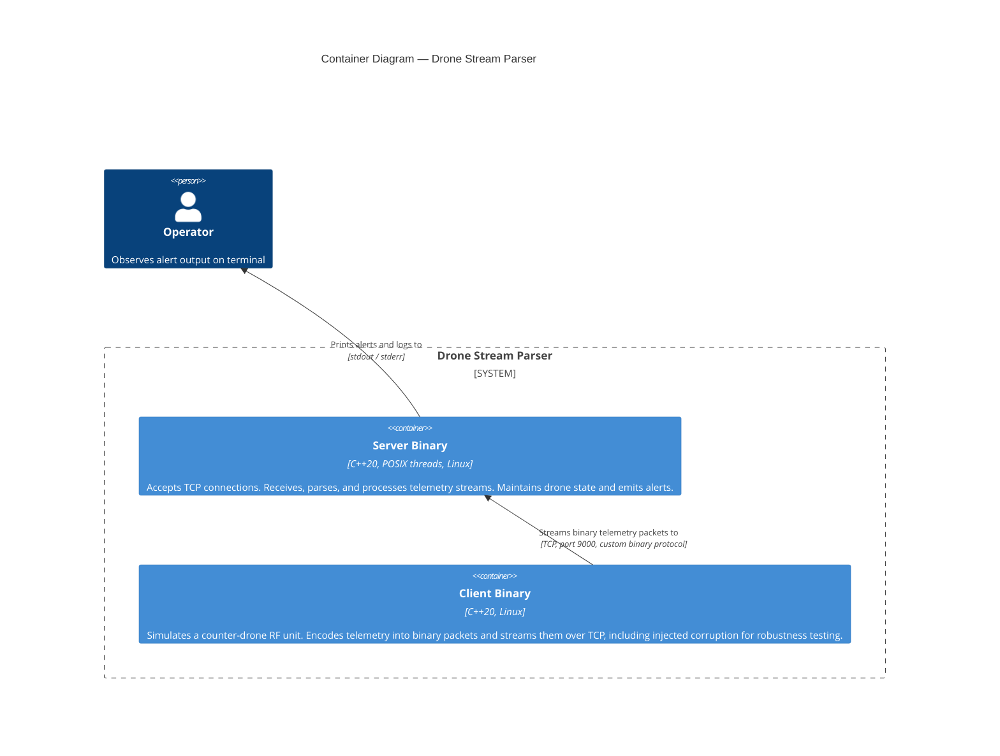
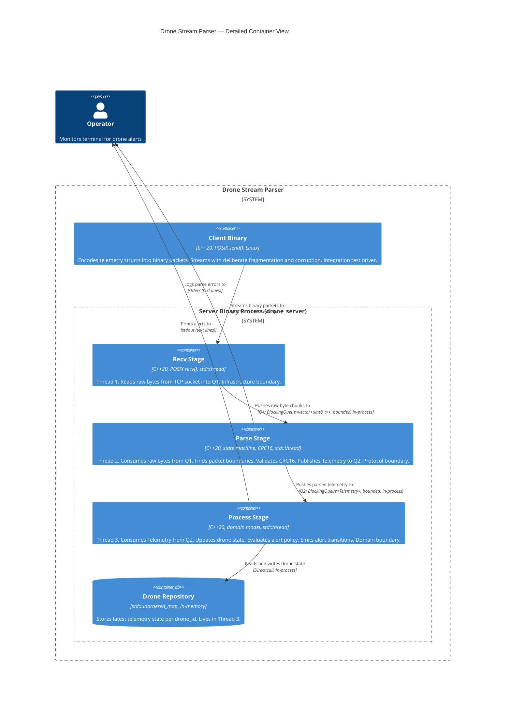

# C4 Container Level: Drone Stream Parser

**Date:** 2026-03-05
**Status:** DRAFT
**Standard:** C++20 | GCC 15.2.1 | CMake 4.2.3 | Linux/POSIX

---

## Overview

The Drone Stream Parser system consists of two independently compiled and executed
binaries. There is no shared runtime — containers communicate exclusively over a
TCP socket using a custom binary protocol. Both binaries are built from a single
CMake project but produce separate deployment units.



---

## Containers

### Server Binary

- **Name**: Server Binary (`drone_server`)
- **Type**: Long-running daemon process
- **Technology**: C++20, POSIX threads (`std::thread`), Berkeley sockets, Linux
- **Build artifact**: `build/drone_server` (CMake executable target)
- **Entry point**: `server/main.cpp` — Composition Root

#### Purpose

The server binary is the system's core deployment unit. It listens on a TCP port,
accepts a streaming binary connection, and drives a 3-stage internal pipeline that
converts raw bytes into processed telemetry with domain-level alert evaluation.

The binary is a single OS process containing three threads connected by two
bounded blocking queues. It runs until it receives SIGINT or SIGTERM, at which
point it executes a graceful cascade shutdown — no data is silently dropped.

The server maps all three architectural boundaries onto a single process:

| Architectural Boundary | Runtime Location |
|------------------------|------------------|
| Infrastructure | Thread 1 (recv) + signal handler, TCP socket, OS |
| Protocol | Thread 2 (parser), CRC16 computation |
| Domain | Thread 3 (processor), in-memory drone repository |

#### Internal Pipeline (Container-Internal Structure)

The 3-stage pipeline is an internal implementation detail of this container, not
an inter-container interface. It is documented here because it is the primary
structural characteristic of the server binary.

```
TCP socket
    │
    │  raw bytes (stream, not packets)
    ▼
┌──────────────────────────────────────────────────────────┐
│                    Server Binary Process                   │
│                                                            │
│  ┌────────────────┐                                        │
│  │  Thread 1      │  POSIX recv() loop                     │
│  │  Recv Stage    │  Infrastructure boundary               │
│  │  (TcpServer)   │  Blocked on socket read.               │
│  └───────┬────────┘  Closes Q1 on shutdown.               │
│          │ Q1: BlockingQueue<vector<uint8_t>>              │
│          │ Bounded. Raw byte chunks. Move semantics.       │
│          ▼                                                  │
│  ┌────────────────┐                                        │
│  │  Thread 2      │  State-machine parser                  │
│  │  Parse Stage   │  Protocol boundary                     │
│  │  (StreamParser)│  HEADER→LENGTH→PAYLOAD→CRC states.    │
│  └───────┬────────┘  Validates CRC16. Resyncs on failure. │
│          │ Q2: BlockingQueue<Telemetry>                    │
│          │ Bounded. Parsed, validated telemetry. Move.     │
│          ▼                                                  │
│  ┌────────────────┐                                        │
│  │  Thread 3      │  ProcessTelemetry use case             │
│  │  Process Stage │  Domain boundary                       │
│  │  (Domain UC)   │  Updates DroneRepository.              │
│  └────────────────┘  Evaluates AlertPolicy. Emits alerts. │
│                                                            │
│  Composition Root (main.cpp):                             │
│    - Creates Q1, Q2 on stack (owns lifetime)              │
│    - Creates pipeline stage objects (injected via ref)    │
│    - Creates AlertPolicy (constexpr defaults)             │
│    - Creates InMemoryDroneRepository                       │
│    - Creates ConsoleAlertNotifier                         │
│    - Starts threads, joins on shutdown                    │
└──────────────────────────────────────────────────────────┘
```

#### Interfaces

##### TCP Inbound Interface

- **Protocol**: TCP (Berkeley sockets, POSIX)
- **Port**: 9000 (default; subject to finalization)
- **Direction**: Inbound — the server accepts connections from clients
- **Transport semantics**: Continuous byte stream — NOT a datagram protocol. The
  server treats the stream as an infinite sequence of bytes and relies on the
  state-machine parser (Protocol boundary) to find packet boundaries.
- **Accepts**: Connections sequentially (one at a time). After a client disconnects, returns to `accept()` to await the next connection. Only exits when `stop_flag` is set. Concurrent multi-client support is not in scope.

##### Binary Packet Wire Format (Inbound)

Each logical telemetry message is encoded as:

```
┌─────────┬────────┬───────────────┬──────────┐
│ HEADER  │ LENGTH │    PAYLOAD    │   CRC    │
│ 2 bytes │ 2 bytes│  LENGTH bytes │ 2 bytes  │
│0xAA 0x55│uint16_t│  Telemetry   │ CRC16    │
└─────────┴────────┴───────────────┴──────────┘

Total wire size: 6 + LENGTH bytes
CRC16 covers: HEADER + LENGTH + PAYLOAD (all bytes before CRC field)
```

Telemetry payload fields (serialized inside PAYLOAD):

| Field | C++ type | Notes |
|-------|----------|-------|
| `drone_id` | `std::string` | uint16_t little-endian byte count prefix, followed by UTF-8 bytes, no null terminator |
| `latitude` | `double` | 8 bytes, IEEE 754, little-endian |
| `longitude` | `double` | 8 bytes, IEEE 754, little-endian |
| `altitude` | `double` | 8 bytes, IEEE 754, little-endian |
| `speed` | `double` | 8 bytes, IEEE 754, little-endian |
| `timestamp` | `uint64_t` | 8 bytes, Unix epoch ms, little-endian |

HEADER is a fixed byte sequence (0xAA then 0x55), not an integer — endianness does not apply.
All multi-byte integer fields (LENGTH, CRC, payload doubles/uint64_t) are little-endian (matches x86-64 target). CRC variant is
CRC-16/CCITT (polynomial 0x1021, init 0x0000), table-driven implementation.
See ADR-008 for full wire format rationale.

##### stdout / stderr Interface

- **Protocol**: POSIX stdout / stderr, line-oriented text
- **Direction**: Outbound — consumed by the operator's terminal or a log collector
- **stdout**: Telemetry alert lines, one per alert transition:
  - `ALERT [drone_id] ALTITUDE 145.2m (entered)`
  - `ALERT [drone_id] SPEED 67.3 m/s (cleared)`
- **stderr**: Diagnostic and error lines — CRC failure counts, parse resync events,
  connection events, shutdown messages

#### Dependencies

##### Containers Used

- **Client Binary**: Provides the inbound TCP byte stream during testing. Not a
  runtime dependency of the server — the server is indifferent to the identity of
  its TCP peer.

##### External Systems

None. The server has no outbound network calls, no database, no message broker,
and no external API dependencies.

#### Infrastructure

- **Build system**: CMake 4.2.3, target `drone_server`
- **Compiler**: GCC 15.2.1, `-std=c++20`
- **OS**: Linux (Ubuntu preferred per spec)
- **Runtime dependencies**: POSIX sockets, `<thread>`, `<atomic>`, `<mutex>`,
  `<condition_variable>` — from C++ stdlib and Linux kernel ABI.
  **spdlog** (via CMake FetchContent, compiled mode) — structured leveled logging
  across all boundaries (see ADR-012).
- **Test dependencies**: GTest + GMock (via CMake FetchContent, build-time only)
- **Scaling**: Single process, single client connection. Vertical only. The bounded
  queues provide back-pressure; the pipeline is designed for at least 1000
  packets/second.
- **Shutdown**: Signal-driven cascade. SIGINT/SIGTERM → `atomic<bool> stop_flag` →
  Thread 1 closes socket and Q1 → Thread 2 drains Q1, closes Q2 → Thread 3 drains
  Q2 and exits → `main()` joins in pipeline order.

---

### Client Binary

- **Name**: Client Binary (`drone_client`)
- **Type**: Short-lived CLI utility process
- **Technology**: C++20, Berkeley sockets, Linux
- **Build artifact**: `build/drone_client` (CMake executable target)
- **Entry point**: `client/main.cpp` — own Composition Root, independent of server

#### Purpose

The client binary is a self-contained test and simulation tool. It acts as the
simulated RF communication layer of a counter-drone embedded unit. It connects to
the server's TCP port and streams encoded binary telemetry packets.

The client binary is explicitly architecturally separate from the server. It does
not share any runtime with the server — it is a distinct OS process with its own
entry point. The two binaries share only the Protocol boundary's packet format
definition (the wire format described above) as a compile-time contract.

The client exercises server robustness by intentionally injecting:
- Fragmented packets (split across multiple send() calls)
- Multiple packets in a single send() buffer
- Random corrupted bytes
- Packets with invalid CRC (deliberate CRC failures)

This makes the client the integration test driver for the Infrastructure boundary
of the server, validating that TcpServer, StreamParser, and the pipeline handle
adversarial stream conditions correctly.

#### Interfaces

##### TCP Outbound Interface

- **Protocol**: TCP (Berkeley sockets, POSIX)
- **Direction**: Outbound — the client initiates the connection to the server
- **Target**: Server Binary at `127.0.0.1:9000` (loopback, configurable)
- **Transport semantics**: Continuous byte stream. The client may send arbitrary
  byte sequences at arbitrary times — including partial packets, concatenated
  packets, and injected corruption.

##### stdout Interface

- **stdin**: Not used in primary mode. Drone ID seeds and scenario parameters
  are provided via CLI arguments.
- **stdout**: Logs what was sent — packet summaries, injected faults, statistics.

#### Dependencies

##### Containers Used

- **Server Binary**: Target of the outbound TCP connection. The server must be
  running before the client connects.

##### External Systems

None.

#### Infrastructure

- **Build system**: CMake 4.2.3, target `drone_client`
- **Compiler**: GCC 15.2.1, `-std=c++20`
- **OS**: Linux
- **Runtime dependencies**: POSIX sockets, C++ stdlib. **spdlog** (via CMake
  FetchContent, compiled mode) — structured leveled logging (see ADR-012).
- **Scaling**: Single instance, single connection. Designed to sustain 1000+
  packets/second for performance validation.
- **Lifetime**: Short-lived. Runs a test scenario and exits. Not a daemon.

---

## Inter-Container Communication

### TCP Binary Protocol

The only inter-container communication channel is the TCP connection between the
client binary (sender) and the server binary (receiver).

| Property | Value |
|----------|-------|
| Transport | TCP/IP |
| Port | 9000 (server-side listen port) |
| Addressing | Loopback (`127.0.0.1`) for local testing |
| Direction | Client → Server (unidirectional data flow) |
| Framing | Custom binary packet format (HEADER + LENGTH + PAYLOAD + CRC) |
| Stream model | Continuous byte stream — receiver must find packet boundaries |
| Reliability | TCP provides ordered delivery; corruption is injected deliberately by client |
| Authentication | None |
| TLS | None (in-scope: local simulation; production hardening is out of scope) |

---

## Boundary-to-Container Mapping

| Architectural Boundary | Container | Deployment Location |
|------------------------|-----------|---------------------|
| Infrastructure | Server Binary | Thread 1 (recv), TCP socket, SignalHandler, OS/POSIX |
| Protocol | Server Binary | Thread 2 (parse), StreamParser, PacketSerializer |
| Domain | Server Binary | Thread 3 (process), ProcessTelemetry, DroneRepository, AlertNotifier |
| Protocol (client-side) | Client Binary | Packet encoding, CRC16 computation, fault injection |
| Infrastructure (client-side) | Client Binary | TCP connect, send loop |

All three architectural boundaries are deployed within the single Server Binary
process. The separation between boundaries is enforced at compile time (CMake
targets, dependency direction) and tested independently (unit tests per boundary,
integration tests via the client binary), but at runtime they share one OS process.

---

## Container Diagram — Detailed View



---

## Shutdown Sequence (Cross-Container)

```
Operator sends SIGINT/SIGTERM
    │
    ▼
Server Binary: stop_flag.store(true)  [atomic<bool>]
    │
    ├─ Thread 1 (Recv):    sees flag → closes listening socket → Q1.close()
    │
    ├─ Thread 2 (Parse):   Q1.pop() returns nullopt → drains remaining Q1 items
    │                       → Q2.close()
    │
    ├─ Thread 3 (Process): Q2.pop() returns nullopt → drains remaining Q2 items
    │                       → exits
    │
    └─ main(): joins Thread 1, Thread 2, Thread 3 (in pipeline order)

Client Binary: independent process — exits when its send scenario completes,
               or on its own SIGINT. Server handles connection close gracefully.
```

No data is silently dropped. Each stage drains its input queue before signaling
downstream. The cascade ensures all in-flight telemetry that entered the pipeline
before the stop signal is processed to completion.

**Client disconnect ≠ shutdown.** When a client disconnects (recv returns EOF), the
server closes the client socket and returns to `accept()` to await the next connection.
Q1 is NOT closed on client disconnect — the pipeline remains running. Q1.close() is
only called when stop_flag is set (SIGINT/SIGTERM).

---

## Resolved Design Decisions

These decisions were resolved in ADR-008 and are reflected in the wire format above:

- **Byte order**: All multi-byte fields are little-endian (matches x86-64 target).
- **String encoding**: `drone_id` uses a uint16_t little-endian byte count prefix
  followed by UTF-8 bytes, no null terminator.
- **CRC variant**: CRC-16/CCITT (polynomial 0x1021, init 0x0000, table-driven).
- **Client scenarios**: 7 named scenarios — normal, fragmented, corrupt, stress,
  alert, multi-drone, interleaved.
- **Multi-client support**: Not in scope, but the architecture does not preclude
  it (the pipeline is independent of the accept loop).

## Open Questions

- **Port number**: 9000 is used as a working assumption. Not yet finalized.
