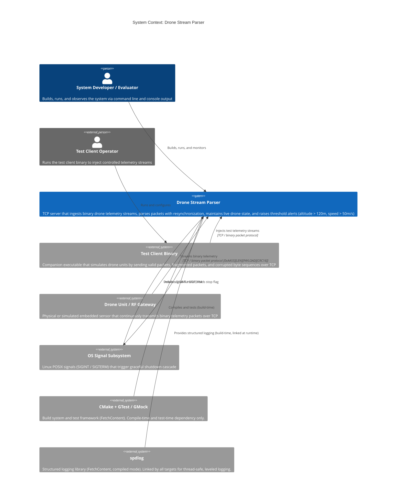

# C4 Context Level: Drone Stream Parser — System Context

**Date:** 2026-03-05
**Status:** DRAFT
**Project Phase:** Pre-code design

---

## System Overview

### Short Description

A multi-threaded TCP server that continuously ingests binary telemetry streams
from drone units, validates and parses packets using a resilient state-machine
parser, maintains a live drone state table, and raises threshold alerts for
altitude and speed violations.

### Long Description

The Drone Stream Parser is a C++20 Linux application that simulates the
communication layer of a counter-drone embedded unit. It acts as the
ground-side receiver in a drone surveillance scenario: drone units (or a test
client that mimics them) connect over TCP and transmit a continuous binary
stream of telemetry packets. The server must handle every pathological condition
present in real RF/embedded communications — fragmented arrival, byte
corruption, CRC failures, and loss of framing synchronization — without
crashing and without silently discarding valid data.

Inside the server, data moves through a three-stage pipeline (network receive
→ stream parse → business logic) with each stage running on a dedicated
thread and connected by bounded, thread-safe queues. The business logic layer
maintains an in-memory table of active drones keyed by drone ID, updates each
drone's state on every valid packet, and evaluates configurable alert policies
for altitude (> 120 m) and speed (> 50 m/s) thresholds. Alert transitions
(entering or clearing a threshold condition) are reported immediately.

The system is designed for throughput of at least 1,000 packets per second and
shuts down gracefully in response to OS signals (SIGINT/SIGTERM), draining
in-flight data from each pipeline stage before terminating.

A companion test client binary (separate executable, same repository) connects
to the server and injects crafted telemetry streams including valid packets,
fragmented packets, corrupted bytes, and high-volume bursts. It is the primary
integration-test tool for the infrastructure layer.

---

## Personas

### Drone Unit (Programmatic Sender)

- **Type:** Programmatic User / External System
- **Description:** A real or simulated counter-drone sensor unit that establishes
  a TCP connection to the parser server and continuously transmits binary
  telemetry packets. In the homework context the actual hardware is absent; the
  test client stands in. In a production deployment this would be an embedded
  device on a drone or ground sensor.
- **Goals:**
  - Establish and maintain a TCP connection to the server.
  - Transmit a continuous binary stream of `[HEADER][LENGTH][PAYLOAD][CRC]`
    packets at high cadence.
  - Deliver telemetry (drone ID, latitude, longitude, altitude, speed,
    timestamp) with no application-level acknowledgement expected.
- **Key Features Used:**
  - Binary stream transmission
  - Packet framing protocol

### Test Client (Operator / Integration Tester)

- **Type:** Human Operator + Programmatic Tool
- **Description:** A developer or QA engineer who runs the companion `client`
  binary from the command line to exercise the server. The test client is a
  separate executable that generates controlled telemetry streams: valid
  high-volume bursts, fragmented packets, corrupted bytes, and boundary-
  condition sequences. It is the integration harness for the infrastructure
  layer.
- **Goals:**
  - Verify correct parsing of well-formed packets.
  - Verify correct resynchronization after injected corruption.
  - Stress-test throughput (1,000+ packets/second target).
  - Confirm that alerts fire for altitude > 120 m and speed > 50 m/s.
  - Confirm clean shutdown behaviour (SIGINT/SIGTERM).
- **Key Features Used:**
  - Binary stream transmission
  - Corruption injection
  - Fragmented packet injection
  - High-volume burst mode

### System Developer / Evaluator

- **Type:** Human User
- **Description:** The C++ engineer implementing and reviewing the system (the
  homework context). Interacts with the system via build tooling (CMake), the
  compiled server binary, the test client binary, and log/console output.
- **Goals:**
  - Build, run, and understand the system from the command line.
  - Observe alert output and CRC-failure logs to confirm correct behaviour.
  - Evaluate architecture, threading model, and parsing logic.
- **Key Features Used:**
  - All features (observer of full system behaviour)

### OS / Signal Subsystem (Programmatic Actor)

- **Type:** Programmatic Actor / External System
- **Description:** The Linux operating system's signal delivery mechanism.
  Sends SIGINT (Ctrl-C) or SIGTERM to the server process to initiate graceful
  shutdown.
- **Goals:**
  - Deliver shutdown signals reliably.
  - Allow the process to complete in-flight work before termination.
- **Key Features Used:**
  - Graceful shutdown cascade

---

## System Features

### 1. Binary Stream Ingestion (TCP Server)

- **Description:** Listens on a TCP port, accepts incoming client connections,
  and continuously receives raw bytes from connected senders. Data is treated
  as an unbounded byte stream — there are no assumptions about packet
  alignment within TCP segments.
- **Users:** Drone Unit, Test Client
- **Key behaviour:** Raw byte chunks are enqueued into Q1 for downstream
  processing. The receive thread blocks on `recv()` and is the only point of
  contact with the TCP socket.

### 2. Resilient State-Machine Stream Parser

- **Description:** Consumes the raw byte stream from Q1 and extracts complete,
  valid telemetry packets. The parser is a state machine that searches for the
  two-byte header `0xAA55`, reads the LENGTH field, buffers the payload, and
  validates the CRC16 computed over HEADER + LENGTH + PAYLOAD. On CRC failure
  it resynchronizes automatically by advancing one byte and re-searching for
  the next valid header. The function is `noexcept` — it never crashes on
  malformed input.
- **Users:** Drone Unit (indirect), Test Client (indirect)
- **Key behaviour:**
  - Handles packets fragmented across multiple TCP reads.
  - Handles multiple packets arriving in a single buffer.
  - Handles random corrupted bytes and loss of synchronization.
  - Counts and logs CRC failures and malformed packets.
  - Emits valid `Telemetry` structs to Q2.

### 3. Drone State Management

- **Description:** Maintains an in-memory table of active drones keyed by
  `drone_id`. For each valid telemetry packet received, the corresponding
  `Drone` entity is found (or created if new) and updated with the latest
  latitude, longitude, altitude, speed, and timestamp.
- **Users:** All (internal pipeline stage, visible via alert output)
- **Key behaviour:** Thread-safe in-memory map; state is authoritative for the
  lifetime of the server process. No persistence to external storage.

### 4. Threshold Alert Evaluation

- **Description:** After each drone state update, the system evaluates the
  drone's current telemetry against a configurable `AlertPolicy`. Constexpr
  defaults are altitude > 120 m and speed > 50 m/s. Alert transitions
  (entering or clearing a condition) are reported — not repeated on every
  packet while a condition is continuously active.
- **Users:** System Developer / Evaluator (observes console output)
- **Key behaviour:** Prints alert to console when a drone enters or clears
  an altitude or speed threshold. Extensible alert type set
  (`std::set<AlertType>`).

### 5. Graceful Shutdown

- **Description:** On receipt of SIGINT or SIGTERM, the system initiates a
  cascade shutdown: the receive thread closes the socket and signals Q1; the
  parse thread drains Q1 and signals Q2; the process thread drains Q2 and
  exits. All threads are joined in pipeline order. No in-flight data is
  silently dropped.
- **Users:** OS / Signal Subsystem, System Developer / Evaluator

### 6. Test Client (Integration Tool)

- **Description:** A companion binary (separate `main.cpp`, separate CMake
  target) that connects to the server over TCP and transmits controlled
  telemetry streams. Covers valid high-volume packets, fragmented packets,
  injected corruption, and boundary sequences.
- **Users:** Test Client (Operator)

---

## User Journeys

### Journey 1: Drone Unit — Continuous Telemetry Stream

This is the primary operational flow. A drone unit (or the test client in
simulation) connects and streams telemetry without any expectation of
application-level responses.

1. **Connect:** Drone unit opens a TCP connection to the server's listening port.
2. **Transmit stream:** Drone continuously writes binary-framed packets:
   `[0xAA55][LENGTH_LE][PAYLOAD][CRC16]`. TCP segments may split or coalesce
   packets arbitrarily.
3. **Server receives bytes:** The network listener thread reads raw bytes via
   `recv()` and pushes byte chunks onto Q1.
4. **Parser consumes Q1:** The stream parser dequeues chunks, feeds them into
   the state machine, and emits validated `Telemetry` structs onto Q2.
5. **Business logic consumes Q2:** The process thread dequeues each `Telemetry`,
   finds or creates the corresponding `Drone`, and calls `updateFrom()`.
6. **Alert evaluation:** If a threshold transition occurred (e.g., altitude
   crossed 120 m upward), `IAlertNotifier` prints the alert to console.
7. **Continue:** Steps 2-6 repeat for the lifetime of the connection.
8. **Disconnect:** TCP connection closes; the server returns to listening.

### Journey 2: Test Client — Corruption and Resynchronization

Exercises the parser's resilience guarantee.

1. **Connect:** Test client opens a TCP connection.
2. **Inject corruption:** Client transmits a stream that includes random
   corrupted bytes interspersed with valid packets.
3. **Parser receives corrupt data:** CRC validation fails on the corrupted
   packet. The parser logs the failure, increments the CRC-failure counter,
   and advances one byte to begin re-searching for `0xAA55`.
4. **Resynchronization:** The parser finds the next valid header and resumes
   normal operation. No crash, no silent data loss for subsequent valid packets.
5. **Operator verifies:** The developer observes CRC-failure log output and
   confirms that subsequent valid packets produce correct drone state updates
   and alerts.

### Journey 3: Test Client — Fragmented Packet Delivery

Exercises partial-read handling.

1. **Connect:** Test client opens a TCP connection.
2. **Send fragment:** Client transmits only the first N bytes of a packet
   (e.g., header + partial length field) and pauses.
3. **Parser buffers:** The state machine transitions to a waiting state,
   buffering the partial data without emitting a telemetry event.
4. **Send remainder:** Client transmits the rest of the packet.
5. **Parser completes:** CRC validates; `Telemetry` is emitted to Q2 and
   processed normally.

### Journey 4: Test Client — High-Volume Burst (Throughput)

Validates the 1,000 packets/second performance requirement.

1. **Connect:** Test client opens a TCP connection.
2. **Burst:** Client transmits 1,000+ valid telemetry packets as fast as TCP
   allows.
3. **Pipeline processes:** Q1 and Q2 absorb the burst within their bounded
   capacity; back-pressure prevents unbounded memory growth.
4. **Operator verifies:** All valid packets produce drone state updates; no
   packets are silently dropped; the system remains stable under load.

### Journey 5: OS Signal — Graceful Shutdown Cascade

1. **Signal received:** Operator presses Ctrl-C or the OS delivers SIGTERM.
2. **Stop flag set:** The `SignalHandler` sets the atomic `stop_flag`.
3. **Receive stage exits:** The listener thread sees the flag, closes the
   socket, and calls `Q1.close()`.
4. **Parse stage drains:** The parser thread's `Q1.pop()` returns `nullopt`,
   the thread flushes any buffered partial packet state, and calls `Q2.close()`.
5. **Process stage drains:** The business logic thread's `Q2.pop()` returns
   `nullopt`; the thread exits.
6. **Main joins threads:** `main()` joins threads in pipeline order (recv ->
   parse -> process).
7. **Clean exit:** Process exits with no data races, no deadlocks, no memory
   leaks.

---

## External Systems and Dependencies

### TCP Network Layer (POSIX Sockets)

- **Type:** OS / POSIX API
- **Description:** The Linux socket API (`socket()`, `bind()`, `listen()`,
  `accept()`, `recv()`, `close()`) provides the raw transport for incoming
  drone data. The server binds to a configurable TCP port.
- **Integration Type:** Direct POSIX syscall (no external library)
- **Purpose:** All drone telemetry arrives as a raw byte stream over TCP.
  The network layer is the sole entry point for external data.

### Drone Units / RF Communication Layer (External Data Source)

- **Type:** External System / Embedded Device
- **Description:** In production, physical drone units or embedded counter-drone
  sensors transmit binary telemetry over a network interface (potentially via
  an RF bridge, serial-to-TCP gateway, or direct Ethernet). In the homework
  simulation, the test client binary plays this role.
- **Integration Type:** TCP byte stream using the binary packet protocol
  `[HEADER=0xAA55][LENGTH:uint16_t][PAYLOAD:Telemetry][CRC16]`
- **Purpose:** The sole source of telemetry data. The system is purpose-built
  to receive and parse this stream.

### OS Signal Subsystem (POSIX Signals)

- **Type:** OS / POSIX API
- **Description:** Linux signal delivery (SIGINT, SIGTERM). The server installs
  a `SignalHandler` that sets an atomic stop flag, triggering the graceful
  shutdown cascade.
- **Integration Type:** POSIX `sigaction` / signal handler
- **Purpose:** Provides the shutdown control path. Without this, the server
  would require forced termination (SIGKILL) and could leak resources.

### GTest / GMock (Test Framework — Build-Time Dependency)

- **Type:** External Library (build-time only, fetched via CMake FetchContent)
- **Description:** Google Test and Google Mock, used for unit tests of the
  Domain boundary and Protocol (parser) boundary. Fakes are used for domain
  port interfaces; mocks are used for external interfaces.
- **Integration Type:** CMake FetchContent (downloaded at configure time)
- **Purpose:** Enables TDD for the Domain and Protocol boundaries without
  requiring production infrastructure to be running.

### spdlog (Logging Library — Build-Time Dependency)

- **Type:** External Library (compiled mode, fetched via CMake FetchContent)
- **Description:** spdlog is a fast, header-only/compiled C++ logging library
  used for structured, leveled logging across all boundaries — infrastructure
  logs TCP events, protocol logs CRC failures and resync, domain logs alert
  transitions, composition root logs startup/shutdown summaries. Compiled mode
  (not header-only) is used for faster incremental builds across multiple
  translation units.
- **Integration Type:** CMake FetchContent (downloaded at configure time,
  compiled as a static library). All targets link `spdlog::spdlog`.
- **Purpose:** Provides thread-safe, leveled, structured logging throughout the
  pipeline without custom logging code.

### CMake Build System

- **Type:** Build Tool / External Dependency
- **Description:** CMake 4.2.3 is the build configuration tool. It defines one
  CMake target per architectural boundary (Domain, Protocol, Infrastructure,
  Common) plus separate targets for the server executable, the client
  executable, and the test suite.
- **Integration Type:** Command-line toolchain (`cmake`, `make` / `ninja`)
- **Purpose:** Provides reproducible, from-source builds on Linux.

### Linux OS / C++ Standard Library

- **Type:** Platform / Runtime Dependency
- **Description:** The system targets Linux (Ubuntu preferred). It depends on
  the C++20 standard library (`std::thread`, `std::atomic`, `std::optional`,
  `std::set`, `std::vector`, `std::span`) and GCC 15.2.1.
- **Integration Type:** Compiled runtime linkage
- **Purpose:** Provides threading primitives, memory management, and standard
  data structures used throughout all boundaries.

---

## System Context Diagram



---

## Data Flow Summary

```
Drone Unit / Test Client
        |
        |  TCP byte stream (binary framed packets)
        v
+-----------------------------------------------------------+
|                  Drone Stream Parser                      |
|                                                           |
|  [Network Listener Thread]                                |
|    recv() raw bytes -> Q1 (BlockingQueue<bytes>)          |
|                                                           |
|  [Stream Parser Thread]                                   |
|    State-machine parser: header search -> length read ->  |
|    payload buffer -> CRC16 validate -> resync on failure  |
|    Q1 -> Q2 (BlockingQueue<Telemetry>)                    |
|                                                           |
|  [Business Logic Thread]                                  |
|    ProcessTelemetry: find/create Drone -> updateFrom() -> |
|    evaluate AlertPolicy -> notify on transitions          |
|    Q2 -> DroneRepository (in-memory) + AlertNotifier      |
|                                                           |
+-----------------------------------------------------------+
        |
        |  Console output: alert transitions, CRC failure counts
        v
   System Developer / Evaluator
```

---

## Alert Policy (Business Rules at Context Level)

| Condition | Threshold | Behaviour |
|-----------|-----------|-----------|
| Altitude exceeded | > 120.0 m | Alert printed on entry; cleared alert printed on exit |
| Speed exceeded | > 50.0 m/s | Alert printed on entry; cleared alert printed on exit |
| CRC failure | Any | Logged; parser resynchronizes; counter incremented |
| Malformed packet | Any | Logged; parser resynchronizes; normal processing continues |

Alert transitions are reported once per state change, not on every packet
while a condition persists. This avoids alert flooding from high-cadence
streams.

---

## Key Design Constraints (Context-Level)

| Constraint | Value |
|------------|-------|
| Transport protocol | TCP (no UDP, no TLS in scope) |
| Packet framing | Binary: `[0xAA55][uint16_t LENGTH][PAYLOAD][CRC16]` |
| Throughput target | >= 1,000 packets/second |
| Platform | Linux (Ubuntu preferred), C++20, GCC |
| Memory model | No external storage; in-process in-memory state only |
| External runtime dependencies | spdlog (compiled mode, fetched via FetchContent) + POSIX + C++ stdlib |
| Persistence | None — drone state is ephemeral, lost on process exit |
| Authentication | None — any TCP client may connect |
| Maximum connections | Single client per server instance (spec does not require multi-client) |

---

## Related Documentation

- [Architecture Design](../architecture.md)
- [Assignment Specification](../../instructions.md)
